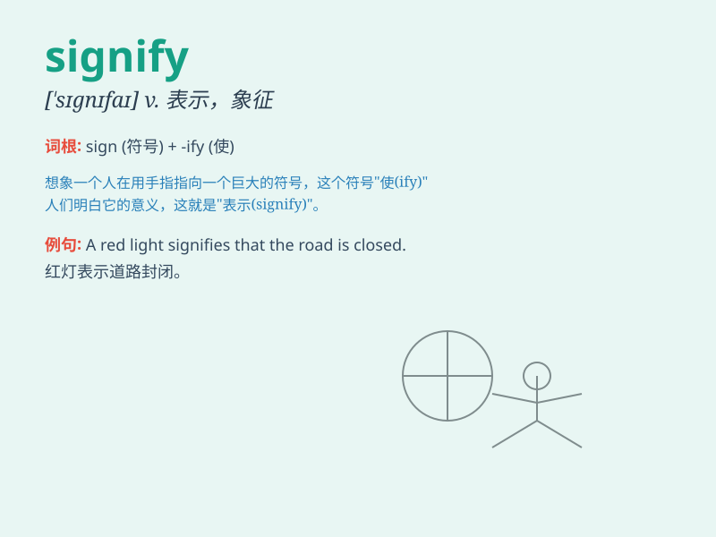

## signify

**英音:** _[\'sɪgnɪfaɪ]_ **美音:** _[\'sɪɡnɪfaɪ]_

**译义:** *vt.表示,意味vi.要紧,有重要性v.颇为重要,表示*

### 短语

+ **signify something to somebody:** _向某人表示某事_

+ **signify one\'s agreement:** _表示同意_

+ **signify a change:** _意味着变化_

+ **signify importance:** _表示重要性_

+ **signify one\'s intention:** _表明意图_

### 例句

#### 例句1

> **The dark clouds signify that a storm is coming.**

**中文翻译:** 乌云意味着暴风雨即将来临。

**单词释义:** 意味着

#### 例句2

> **This symbol signifies love and peace.**

**中文翻译:** 这个符号象征着爱与和平。

**单词释义:** 象征

#### 例句3

> **His silence signified his agreement.**

**中文翻译:** 他的沉默表示他同意了。

**单词释义:** 表示

### 背诵小故事

> One day, a king needed to send a message. He used a special symbol on
a banner to signify his order. The symbol was understood by all and it
meant something important was going to happen.

**有一天，一位国王需要传达一个信息。他在旗帜上使用了一个特殊的符号来表示他的命令。这个符号被所有人理解，意味着重要的事情将要发生。**

### 图义

