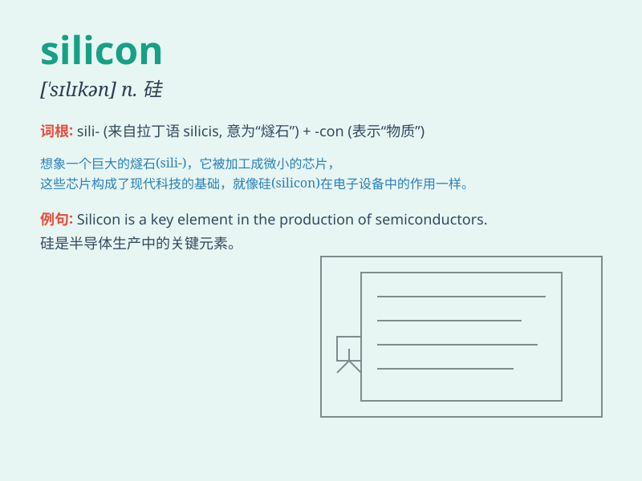

## silicon

**英音:** _[\'sɪlɪk(ə)n]_ **美音:** _[\'sɪlɪkən]_

**译义:** *n.[化]硅,硅元素*

### 短语

+ **silicon chip:** _硅片_

+ **silicon valley:** _硅谷（美国高科技产业集中地）_

+ **silicon dioxide:** _二氧化硅_

+ **silicon wafer:** _硅晶圆_

+ **silicon nitride:** _氮化硅_

### 例句

#### 例句1

> **Silicon is widely used in the semiconductor industry.**

**中文翻译:** 硅在半导体工业中被广泛使用。

**单词释义:** 硅

#### 例句2

> **The new computer chip is made of high-quality silicon.**

**中文翻译:** 新的计算机芯片是由高质量的硅制成的。

**单词释义:** 硅

#### 例句3

> **Silicon Valley is known for its innovation in technology.**

**中文翻译:** 硅谷以其在技术方面的创新而闻名。

**单词释义:** 硅（此处指硅谷）

### 背诵小故事

>
想象一下，在一个未来世界，机器人统治了地球。这些机器人的核心部件由一种叫做\'silicon\'的物质制成，它像魔法晶体，赋予机器人智慧和力量。因为有了
silicon，机器人变得无比强大。

**想象在未来世界，机器人的核心部件由硅这种物质制成，它让机器人强大，以此记住
silicon （硅）这个单词。**

### 图义

