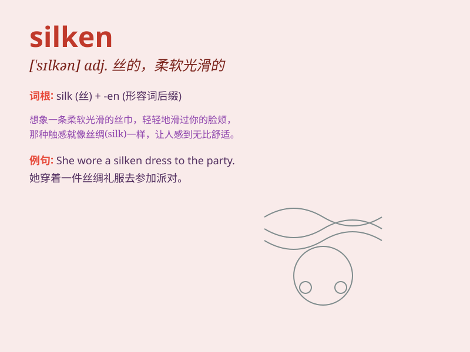

## silken

**英音:** _[\'sɪlk(ə)n]_ **美音:** _[\'sɪlkən]_

**译义:** *adj.柔软光滑的*

### 短语

+ **silken hair:** _柔软光滑的头发_

+ **silken fabric:** _丝绸织物_

+ **silken voice:** _柔和的嗓音_

+ **silken texture:** _丝滑的质地_

+ **silken smoothness:** _如丝般的光滑_

### 例句

#### 例句1

> **She wore a silken dress to the party.**

**中文翻译:** 她穿着一件丝绸裙子去参加聚会。

**单词释义:** 丝绸的（形容裙子的材质）

#### 例句2

> **The silken hair flowed down her back.**

**中文翻译:** 她那如丝般的头发垂在背上。

**单词释义:** 如丝般的（形容头发的质地）

#### 例句3

> **The horse\'s silken coat shone in the sunlight.**

**中文翻译:** 这匹马丝绸般的皮毛在阳光下闪闪发亮。

**单词释义:** 丝绸般的（形容马的皮毛）

### 背诵小故事

> Once upon a time, there was a princess with long silken hair. It was
so soft and smooth that it shone like silk in the moonlight. Everyone
admired her beautiful silken tresses.

**从前，有一位公主，她有着长长的如丝般的头发。它是如此柔软顺滑，在月光下像丝绸一样闪耀。每个人都羡慕她美丽的如丝般的秀发。**

### 图义

