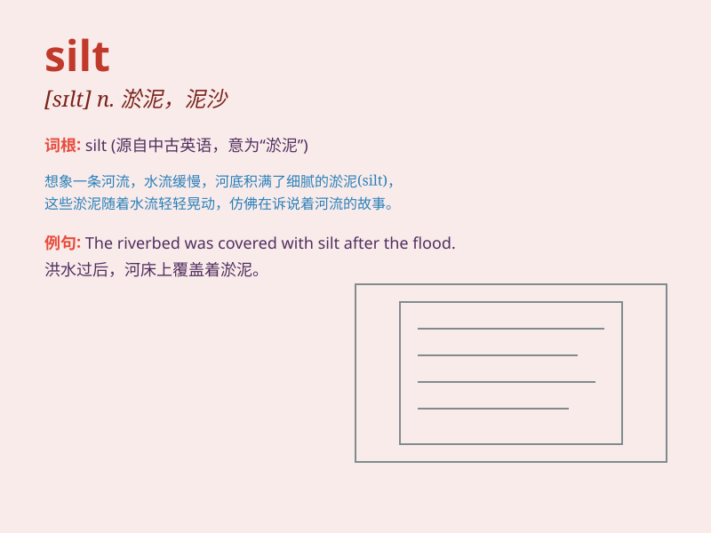

## silt

**英音:** _[sɪlt]_ **美音:** _[sɪlt]_

**译义:** *n.淤泥,残渣,煤粉,泥沙v.(使)淤塞,充塞*

### 短语

+ **silt up:** _（使）淤塞_

+ **silt deposit:** _淤泥沉积_

+ **silt content:** _淤泥含量_

+ **silt load:** _含沙量；输沙量_

+ **silt barrier:** _淤泥屏障_

### 例句

#### 例句1

> **The river was choked with silt.**

**中文翻译:** 这条河被淤泥堵塞了。

**单词释义:** 淤泥

#### 例句2

> **The silt at the bottom of the lake gradually accumulated over
time.**

**中文翻译:** 湖底的淤泥随着时间逐渐堆积。

**单词释义:** 淤泥

#### 例句3

> **The workers dredged the silt from the canal to improve
navigation.**

**中文翻译:** 工人们从运河中疏浚淤泥以改善通航。

**单词释义:** 淤泥

### 背诵小故事

> A brave diver was exploring an underwater cave. As he swam, he
noticed a lot of fine particles. These were silt. They made the water a
bit murky, but he knew silt was just tiny pieces of soil carried by
water.

**一位勇敢的潜水员正在探索一个水下洞穴。当他游的时候，他注意到很多细小的颗粒。这些就是淤泥。它们让水有点浑浊，但他知道淤泥只是被水携带的细小的土壤颗粒。**

### 图义

