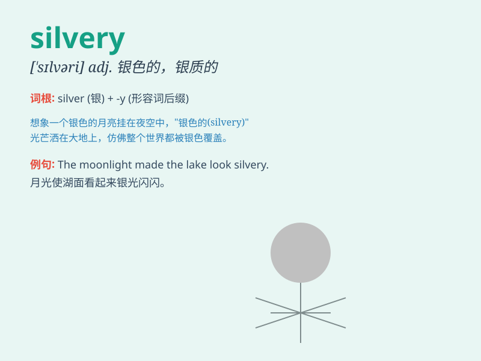

## silvery

**英音:** _[\'sɪlv(ə)rɪ]_ **美音:** _[\'sɪlvəri]_

**译义:** *adj.似银的,有银色光泽的,银铃一般的,清脆的*

### 短语

+ **silvery moon:** _银色的月亮_

+ **silvery hair:** _银色的头发_

+ **silvery voice:** _银铃般的嗓音_

+ **silvery light:** _银色的光_

+ **silvery lake:** _银色的湖_

### 例句

#### 例句1

> **The moon cast a silvery light over the landscape.**

**中文翻译:** 月亮在大地上洒下银色的光芒。

**单词释义:** 银色的

#### 例句2

> **She has silvery hair that shines in the sunlight.**

**中文翻译:** 她有在阳光下闪闪发亮的银色头发。

**单词释义:** 银色的

#### 例句3

> **The fish had a silvery sheen on its scales.**

**中文翻译:** 这条鱼的鳞片有银色的光泽。

**单词释义:** 银色的

### 背诵小故事

> A girl was walking in the forest at night. The moonlight shone
through the trees, making everything look silvery. She was amazed by the
silvery beauty and felt as if she was in a magical world.

**一个女孩在夜晚的森林里散步。月光透过树木洒下，让一切看起来都银光闪闪。她被这银白的美丽所惊艳，感觉自己仿佛置身于一个神奇的世界。**

### 图义

