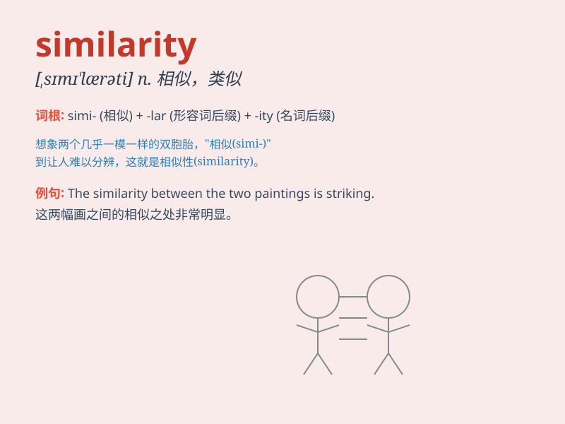

## similarity

**英音:** _[sɪmə\'lærətɪ]_ **美音:** _[,sɪmə\'lærəti]_

**译义:** *n.类似,类似处*

### 短语

+ **bear similarity:** _具有相似性_

+ **show similarity:** _显示相似之处_

+ **find similarity:** _发现相似性_

+ **have similarity:** _有相似之处_

+ **notice similarity:** _注意到相似性_

### 例句

#### 例句1

> **There is a certain similarity between the two designs.**

**中文翻译:** 这两种设计之间有一定的相似性。

**单词释义:** 相似性

#### 例句2

> **The similarity in their tastes led them to become good
friends.**

**中文翻译:** 他们品味上的相似性使他们成为了好朋友。

**单词释义:** 相似性

#### 例句3

> **Despite some similarities, there are also significant
differences.**

**中文翻译:** 尽管有一些相似之处，但也有显著的差异。

**单词释义:** 相似之处

### 背诵小故事

> One day, Tom and Jerry found two cakes with great similarity. They
looked almost the same in shape and color. But on a closer look, they
noticed some tiny differences. This showed them what similarity means.

**有一天，汤姆和杰瑞发现了两块非常相似的蛋糕。它们在形状和颜色上看起来几乎一样。但仔细一看，他们注意到了一些细微的差别。这就让他们明白了相似性的意思。**

### 图义

