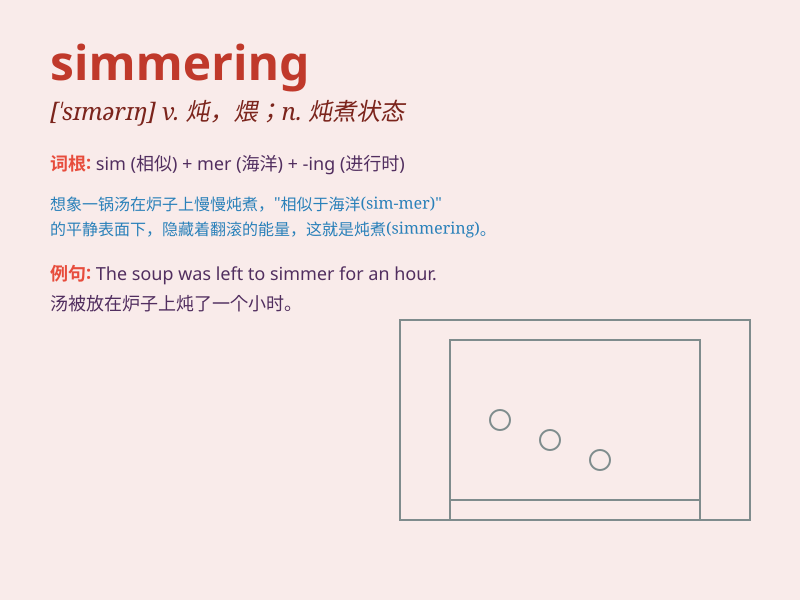

## simmering

**英音:** _[ˈsɪmərɪŋ]_ **美音:** _[ˈsɪmərɪŋ]_

**译义:** *adj. 沸腾的；愤怒的；酝酿中的；vi.
(情感等)在酝酿中；(用小火)炖着；n. 小火慢炖；(情感等的)酝酿状态*

### 短语

+ **simmering anger:** _即将爆发的怒火_

+ **simmering dispute:** _逐渐升温的争端_

+ **simmering tension:** _不断加剧的紧张局势_

+ **simmering soup:** _正在慢炖的汤_

+ **simmering emotions:** _压抑的情绪_

### 例句

#### 例句1

> **The simmering conflict between the two countries finally erupted
into a full-scale war.**

**中文翻译:** 两国之间酝酿已久的冲突最终爆发成了一场全面战争。

**单词释义:** 逐渐加剧但尚未爆发的

#### 例句2

> **There was a simmering anger in her voice as she spoke about the
injustice.**

**中文翻译:** 当她谈到不公平时，声音中带着压抑的愤怒。

**单词释义:** 压抑的；隐而未发的

#### 例句3

> **The simmering pot of soup smelled delicious.**

**中文翻译:** 那锅正在慢慢炖煮的汤闻起来很香。

**单词释义:** 慢慢炖煮的

### 背诵小故事

>
想象一下，你在厨房煮着一锅汤，小火慢炖，锅里的汤只是微微冒泡，处于一种即将沸腾但还没完全沸腾的状态，这就是
simmering。就像内心的怒火，压抑着但随时可能爆发。

**想象在厨房煮汤，汤微微冒泡、即将沸腾但未完全沸腾的状态，像压抑的怒火，这就是
simmering 的情景。**

### 图义

