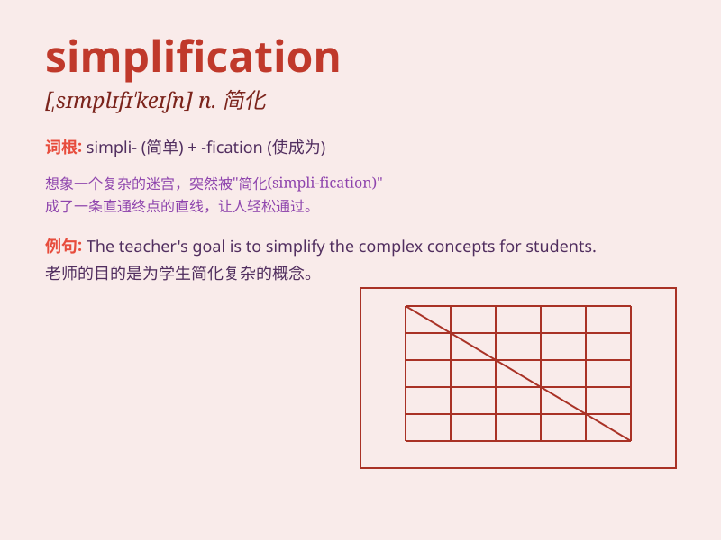

## simplification

**英音:** _[,sɪmplɪfɪ\'keɪʃən]_ **美音:**
_[,sɪmplɪfɪ\'keʃən]_

**译义:** *n.简化*

### 短语

+ **simplification process:** _简化过程_

+ **simplification method:** _简化方法_

+ **simplification strategy:** _简化策略_

+ **constant simplification:** _持续简化_

+ **system simplification:** _系统简化_

### 例句

#### 例句1

> **The simplification of the tax system has reduced administrative
burdens.**

**中文翻译:** 税收制度的简化减轻了行政负担。

**单词释义:** 简化；精简

#### 例句2

> **This software provides a simplification of complex data analysis
processes.**

**中文翻译:** 这款软件对复杂的数据分析流程进行了简化。

**单词释义:** 简化；使简单

#### 例句3

> **The simplification of the design made the product more
user-friendly.**

**中文翻译:** 设计的简化使产品更方便用户使用。

**单词释义:** 简化；简易化

### 背诵小故事

> A student was struggling with a complex math problem. But with the
simplification skills taught by the teacher, the problem became easy.
The student finally understood the power of simplification.

**一个学生在为一道复杂的数学题苦恼。但在老师教授的简化技巧下，问题变得容易了。这个学生终于明白了简化的力量。**

### 图义

