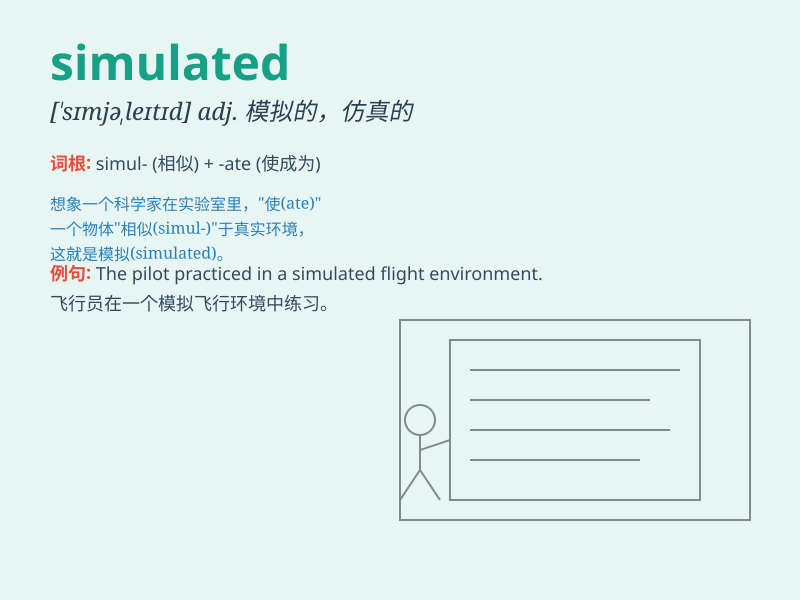

## simulated

**英音:** _[ˈsɪmjəleɪtɪd]_ **美音:** _[ˈsɪmjəleɪtɪd]_

**译义:** *adj.模拟的；仿真的；假装的*

### 短语

+ **simulated annealing:** _模拟退火_

+ **simulated experiment:** _模拟实验_

+ **simulated flight:** _模拟飞行_

+ **simulated training:** _模拟训练_

+ **simulated environment:** _模拟环境_

### 例句

#### 例句1

> **The flight simulator provides a simulated experience of flying a
real airplane.**

**中文翻译:** 飞行模拟器提供了一种模拟驾驶真正飞机的体验。

**单词释义:** 模拟的

#### 例句2

> **The scientists conducted a simulated experiment to test the
hypothesis.**

**中文翻译:** 科学家们进行了一个模拟实验来检验这个假设。

**单词释义:** 模拟的

#### 例句3

> **The game features simulated battles in a fantasy world.**

**中文翻译:** 这个游戏以幻想世界中的模拟战斗为特色。

**单词释义:** 模拟的

### 背诵小故事

> A brave astronaut was training in a simulated space environment. He
faced many challenges as if he were really in space. Through this
simulated experience, he prepared well for the real mission.

**一位勇敢的宇航员在模拟的太空环境中训练。他面临许多挑战，就好像真的在太空一样。通过这种模拟的体验，他为真正的任务做好了充分准备。**

### 图义

