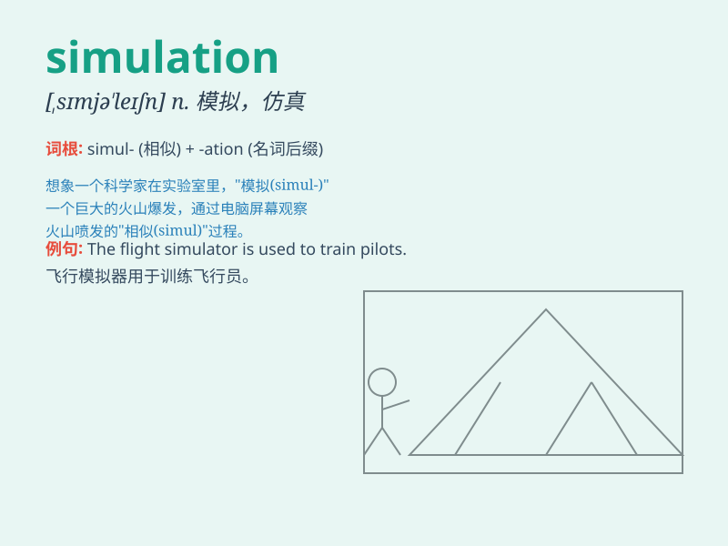

## simulation

**英音:** _[,sɪmjʊ\'leɪʃən]_ **美音:**
_[\'sɪmjə\'leʃən]_

**译义:** *n.仿真,假装 模拟*

### 短语

+ **computer simulation:** _计算机模拟_

+ **simulation model:** _模拟模型_

+ **simulation experiment:** _模拟实验_

+ **dynamic simulation:** _动态模拟_

+ **simulation software:** _模拟软件_

### 例句

#### 例句1

> **The simulation of the car crash was very realistic.**

**中文翻译:** 这次汽车碰撞的模拟非常逼真。

**单词释义:** 模拟

#### 例句2

> **Computer simulations can help predict the weather.**

**中文翻译:** 计算机模拟可以帮助预测天气。

**单词释义:** 模拟

#### 例句3

> **The flight simulation training is essential for pilots.**

**中文翻译:** 飞行模拟训练对飞行员来说是必不可少的。

**单词释义:** 模拟

### 背诵小故事

>
想象一下，一位科学家在实验室里创造了一个虚拟世界，里面的一切都是对真实世界的模拟（simulation）。他通过各种数据和模型，让这个虚拟世界尽可能逼真，就像在进行一场神奇的实验。

**想象一位科学家在实验室创造模拟真实世界的虚拟世界的情景来辅助记忆simulation（模拟；仿真）这个单词。**

### 图义

