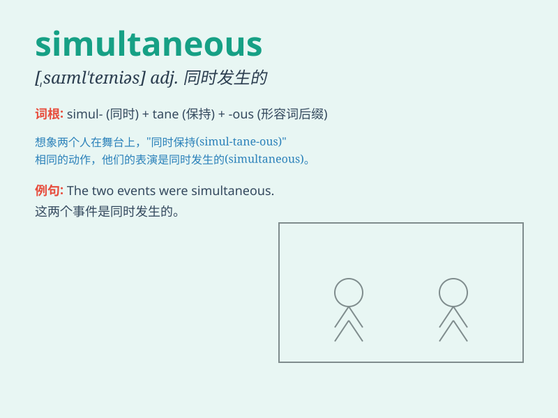

## simultaneous

**英音:** _[,sɪm(ə)l\'teɪnɪəs]_ **美音:**
_[,saɪml\'tenɪəs]_

**译义:** *adj.同时的,同时发生的*

### 短语

+ **simultaneous interpretation:** _同声传译_

+ **simultaneous equations:** _联立方程_

+ **simultaneous operation:** _同时操作_

+ **simultaneous occurrence:** _同时发生_

+ **simultaneous measurement:** _同时测量_

### 例句

#### 例句1

> **The two events were simultaneous and happened at exactly the same
time.**

**中文翻译:** 这两个事件是同时发生的，并且在完全相同的时间发生。

**单词释义:** 同时的

#### 例句2

> **The simultaneous translation made the conference accessible to a
wider audience.**

**中文翻译:** 同声传译使更多的听众能够参与这次会议。

**单词释义:** 同时进行的

#### 例句3

> **The simultaneous release of the new products caused a stir in the
market.**

**中文翻译:** 新产品的同时发布在市场上引起了轰动。

**单词释义:** 同时的

### 背诵小故事

>
想象一下，在一个盛大的音乐会上，乐队的指挥同时(simultaneous)挥动双手，让小提琴手和钢琴手同时演奏出美妙的旋律，观众们沉浸在这同步的美妙音乐中。

**想象在音乐会上指挥让乐手同时演奏来辅助记忆 simultaneous
同时的意思**

### 图义

