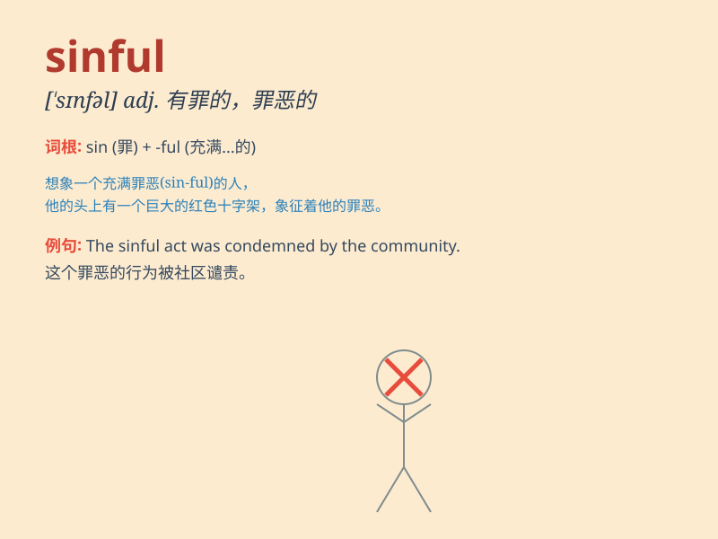

## sinful

**英音:** _[\'sɪnfʊl; -f(ə)l]_ **美音:** _[\'sɪnfl]_

**译义:** *adj.有罪的,罪孽深重的*

### 短语

+ **sinful act:** _罪恶的行为_

+ **sinful nature:** _罪恶的本性_

+ **sinful life:** _罪恶的生活_

+ **sinful thoughts:** _罪恶的想法_

+ **sinful deeds:** _罪恶的事迹_

### 例句

#### 例句1

> **His actions were considered sinful by the religious
community.**

**中文翻译:** 他的行为被宗教团体认为是有罪的。

**单词释义:** 有罪的；罪恶的

#### 例句2

> **The sinful pleasures of gambling led him to financial ruin.**

**中文翻译:** 赌博这种罪恶的享乐使他陷入财务破产。

**单词释义:** 罪恶的；不道德的

#### 例句3

> **She felt deeply repentant for her sinful past.**

**中文翻译:** 她对自己罪恶的过去深感懊悔。

**单词释义:** 罪恶的；有罪孽的

### 背诵小故事

> A thief was stealing jewels from a church. He knew it was sinful but
was driven by greed. When caught, he felt deep remorse. Remember,
actions like this are sinful and will lead to punishment.

**一个小偷从教堂偷珠宝。他知道这是有罪的，但被贪婪驱使。当被抓住时，他深感懊悔。记住，像这样的行为是有罪的，会导致惩罚。**

### 图义

