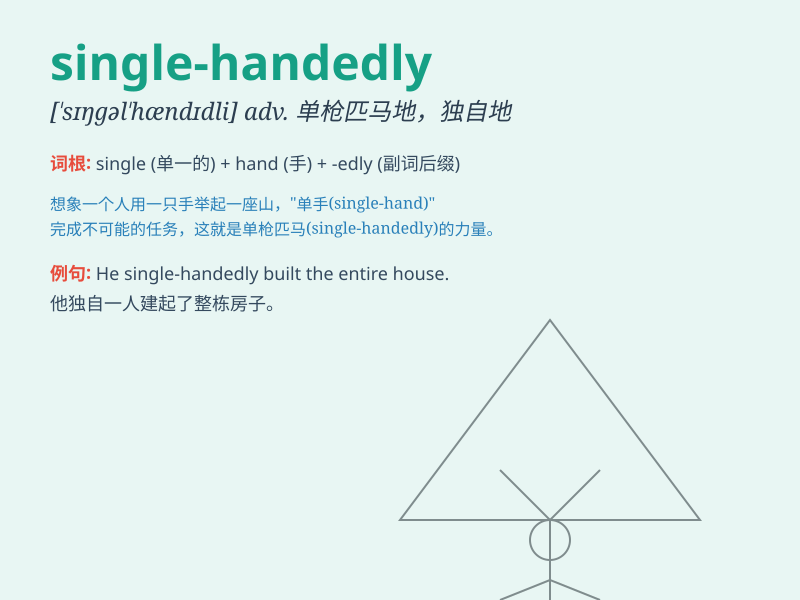

## single-handedly

**英音:** _[ˈsɪŋɡəl ˈhændɪdli]_ **美音:** _[ˈsɪŋɡəl
ˈhændɪdli]_

**译义:** *adv. 单枪匹马地；单独地；独力地*

### 短语

+ **single-handedly manage:** _独自管理_

+ **single-handedly achieve:** _独自达成_

+ **single-handedly solve:** _独自解决_

+ **single-handedly complete:** _独自完成_

+ **single-handedly overcome:** _独自克服_

### 例句

#### 例句1

> **He single-handedly built the entire house.**

**中文翻译:** 他独自一人建造了整座房子。

**单词释义:** 独自一人地

#### 例句2

> **She single-handedly solved the complex problem.**

**中文翻译:** 她单枪匹马地解决了这个复杂的问题。

**单词释义:** 单枪匹马地

#### 例句3

> **The athlete single-handedly broke the world record.**

**中文翻译:** 这位运动员独自打破了世界纪录。

**单词释义:** 独自

### 背诵小故事

> A brave warrior single-handedly fought against a group of monsters to
protect the village. With only one hand holding the sword, he showed
amazing courage and strength. Eventually, he won and became a hero.

**一位勇敢的战士单枪匹马地与一群怪物战斗以保护村庄。仅用一只手握剑，他展现出了惊人的勇气和力量。最终，他获胜并成为了英雄。**

### 图义

