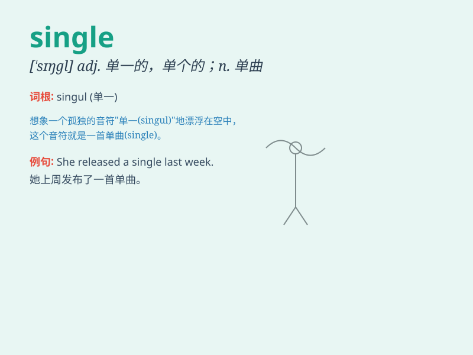

## single

**英音:** _[\'sɪŋg(ə)l]_ **美音:** _[\'sɪŋɡl]_

**译义:**
*adj.单一的,单身的,单纯的,孤独的,专一的,个别的n.一个,单打,单精度型vt.选出vi.[棒]作一垒打*

### 短语

+ **single out:** _挑出；选出_

+ **single file:** _一路纵队；单行_

+ **single bed:** _单人床_

+ **single parent:** _单亲_

+ **single ticket:** _单程票_

### 例句

#### 例句1

> **I enjoy being single and having the freedom to do as I
please.**

**中文翻译:** 我喜欢单身，享受能够随心所欲做事的自由。

**单词释义:** 单身的

#### 例句2

> **She bought a single ticket for the concert.**

**中文翻译:** 她买了一张音乐会的单程票。

**单词释义:** 单一的；单程的

#### 例句3

> **There is a single flower in the vase.**

**中文翻译:** 花瓶里有一朵花。

**单词释义:** 单个的；单一的

### 背诵小故事

> A young man was always single. One day, he decided to go on a journey
to find love. On the way, he met a special girl and finally ended his
single life. Remember, \'single\' means alone or unmarried.

**一个年轻人一直单身。有一天，他决定去旅行寻找爱情。在路上，他遇到了一个特别的女孩，终于结束了他的单身生活。记住，'single'意思是单独的或未婚的。**

### 图义

