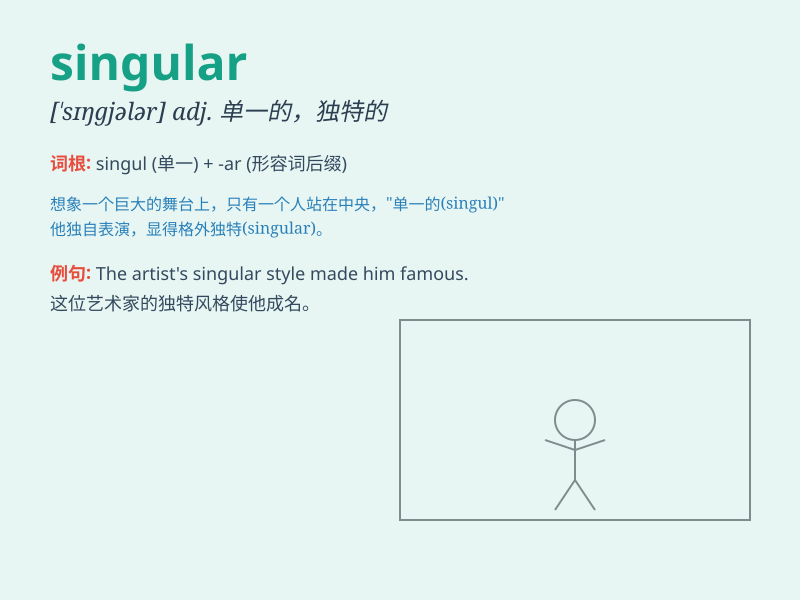

## singular

**英音:** _[\'sɪŋgjʊlə]_ **美音:** _[\'sɪŋɡjəlɚ]_

**译义:** *n.单数adj.单一的,非凡的,异常的,持异议的*

### 短语

+ **singular form:** _单数形式_

+ **singular noun:** _单数名词_

+ **singular value:** _奇异值_

+ **singular matrix:** _奇异矩阵_

+ **singular point:** _奇点_

### 例句

#### 例句1

> **The noun \'child\' is in the singular form.**

**中文翻译:** 名词\'child\'是单数形式。

**单词释义:** 单数的

#### 例句2

> **She has a singular talent for music.**

**中文翻译:** 她有独特的音乐天赋。

**单词释义:** 独特的；非凡的

#### 例句3

> **The problem presented a singular challenge.**

**中文翻译:** 这个问题带来了一个特殊的挑战。

**单词释义:** 特殊的；异常的

### 背诵小故事

> A king was always dressed in a singular outfit. No one else wore the
same. It made him stand out. \'Singular\' means unique or one of a kind,
just like the king\'s clothes.

**一位国王总是穿着独特的服装。没有其他人穿同样的。这使他脱颖而出。'singular'意思是独特的、独一无二的，就像国王的衣服一样。**

### 图义

