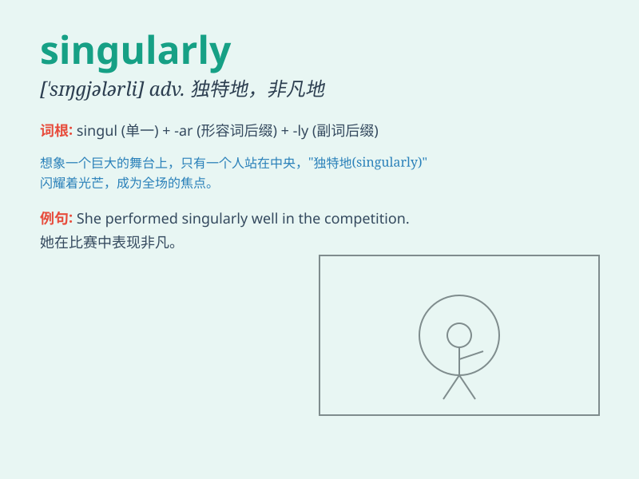

## singularly

**英音:** _[ˈsɪŋɡjələli]_ **美音:** _[ˈsɪŋɡjələrli]_

**译义:** *adv.不常见地,另人无法理解地,异乎寻常地*

### 短语

+ **singularly beautiful:** _极其美丽_

+ **singularly talented:** _极具天赋_

+ **singularly important:** _极其重要_

+ **singularly charming:** _特别迷人_

+ **singularly difficult:** _特别困难_

### 例句

#### 例句1

> **The book is singularly fascinating.**

**中文翻译:** 这本书特别迷人。

**单词释义:** 非常；特别

#### 例句2

> **She was singularly beautiful.**

**中文翻译:** 她美得非凡。

**单词释义:** 非凡地；异常地

#### 例句3

> **He performed singularly well in the exam.**

**中文翻译:** 他在考试中表现得极为出色。

**单词释义:** 极其；极为

### 背诵小故事

> A young artist was singularly focused on creating a unique
masterpiece. Despite many distractions, she remained singularly
determined and finally achieved success. It means being exceptionally or
remarkably.

**一位年轻的艺术家特别专注于创作一幅独特的杰作。尽管有很多干扰，她仍然非常坚定，最终取得了成功。这个词意思是特别地、异常地。**

### 图义

