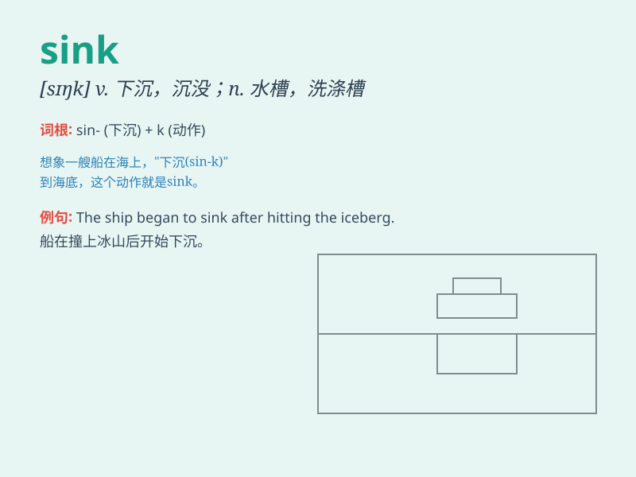

## sink

**英音:** _[sɪŋk]_ **美音:** _[sɪŋk]_

**译义:** *vi.沉下,(使)下沉n.水槽,水池 接收器*

### 短语

+ **sink in:** _被理解；被领会_

+ **sink into:** _陷入（某种状态）_

+ **sink down:** _下沉；倒下_

+ **sink or swim:** _不论成败；孤注一掷_

+ **heart sink:** _心情沉重；心灰意冷_

### 例句

#### 例句1

> **The ship sank in the storm.**

**中文翻译:** 这艘船在风暴中沉没了。

**单词释义:** 沉没

#### 例句2

> **She sank into the chair, exhausted.**

**中文翻译:** 她筋疲力尽，一下子瘫坐在椅子上。

**单词释义:** 陷入

#### 例句3

> **The sun was sinking below the horizon.**

**中文翻译:** 太阳正沉到地平线以下。

**单词释义:** 下沉

### 背诵小故事

> A thief was stealing gold in a house. Suddenly, the floor started to
sink. He was so scared and regretted his bad behavior. The word \'sink\'
means to go down gradually or fall below the surface.

**一个小偷正在一间房子里偷金子。突然，地板开始下沉。他非常害怕，并为自己的不良行为感到后悔。单词
\'sink\' 意思是逐渐下降或沉到表面以下。**

### 图义

