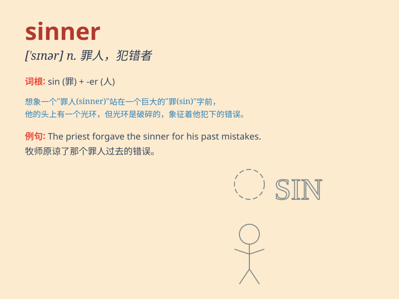

## sinner

**英音:** _[\'sɪnə]_ **美音:** _[\'sɪnɚ]_

**译义:** *n.罪人,不信神的人*

### 短语

+ **habitual sinner:** _惯犯_

+ **great sinner:** _大罪人_

+ **repentant sinner:** _忏悔的罪人_

+ **mortal sinner:** _不可饶恕的罪人_

+ **chief sinner:** _罪魁祸首_

### 例句

#### 例句1

> **The priest offered forgiveness to the sinner.**

**中文翻译:** 牧师向罪人给予宽恕。

**单词释义:** 罪人

#### 例句2

> **He saw himself as a sinner in need of redemption.**

**中文翻译:** 他认为自己是一个需要救赎的罪人。

**单词释义:** 罪人

#### 例句3

> **The book portrays the journey of a sinner seeking salvation.**

**中文翻译:** 这本书描绘了一个罪人寻求拯救的旅程。

**单词释义:** 罪人

### 背诵小故事

> Once upon a time, there was a man who always did bad things and broke
the law. Everyone called him a sinner. But one day, he realized his
mistakes and decided to change.

**从前，有一个总是做坏事和违法的人。每个人都称他为罪人。但有一天，他意识到自己的错误并决定改变。**

### 图义

