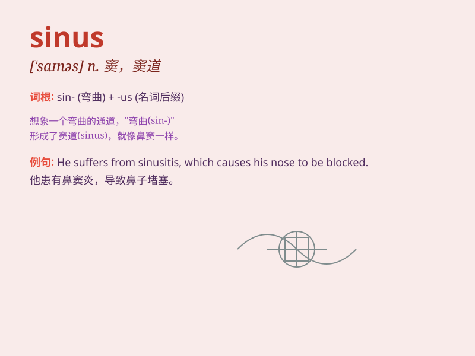

## sinus

**英音:** _[\'saɪnəs]_ **美音:** _[\'saɪnəs]_

**译义:** *n.窦,穴,湾,凹处*

### 短语

+ **sinus rhythm:** _窦性心律_

+ **sinus headache:** _窦性头痛_

+ **sinus infection:** _鼻窦感染_

+ **maxillary sinus:** _上颌窦_

+ **frontal sinus:** _额窦_

### 例句

#### 例句1

> **I have been suffering from a sinus infection recently.**

**中文翻译:** 我最近一直遭受鼻窦感染的困扰。

**单词释义:** 鼻窦

#### 例句2

> **The doctor examined my sinus carefully.**

**中文翻译:** 医生仔细检查了我的鼻窦。

**单词释义:** 鼻窦

#### 例句3

> **Sinus problems can cause severe headaches.**

**中文翻译:** 鼻窦问题可能会导致严重的头痛。

**单词释义:** 鼻窦

### 背诵小故事

>
想象一下，一个勇敢的探险家在洞穴中探险，突然遇到了一些弯曲的通道，就像'sinus'（窦，窦道）一样。他小心地沿着这些复杂的窦道前行，最终成功走出洞穴。

**想象一位探险家在洞穴中遇到如'窦道'般的弯曲通道并成功走出的故事来辅助记忆'sinus'这个单词。**

### 图义

