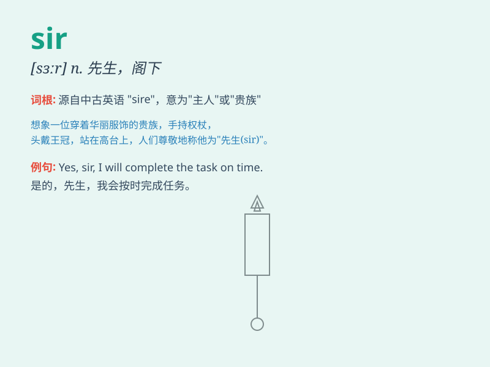

## sir

**英音:** _[sɜː]_ **美音:** _[sɝ]_

**译义:** *n.先生,阁下,(对爵士或男爵前的尊称)爵士*

### 短语

+ **Dear sir:** _尊敬的先生_

+ **Sir John:** _约翰爵士_

+ **Yes, sir.:** _是，先生。_

+ **Sir Galahad:** _加拉哈德爵士_

+ **Sir Winston Churchill:** _温斯顿·丘吉尔爵士_

### 例句

#### 例句1

> **Good morning, sir.**

**中文翻译:** 早上好，先生。

**单词释义:** 先生（用于对男性的尊称）

#### 例句2

> **Yes, sir. I\'ll do it right away.**

**中文翻译:** 好的，先生。我马上就做。

**单词释义:** 先生（用于对上级或长辈的称呼）

#### 例句3

> **Thank you, sir. Have a nice day.**

**中文翻译:** 谢谢您，先生。祝您有美好的一天。

**单词释义:** 先生（表示礼貌和尊敬）

### 背诵小故事

> 有一天，小明在迷路时遇到一位穿着得体的男士。小明礼貌地询问：\'Sir,
could you please help me?\'
男士微笑着给他指路。这里的\'Sir\'就是对男士的尊称，表达尊敬。

**有一天，小明迷路时向一位穿着得体的男士求助，称呼其为\'Sir\'，这里\'Sir\'是对男士的尊称，表示尊敬。**

### 图义

