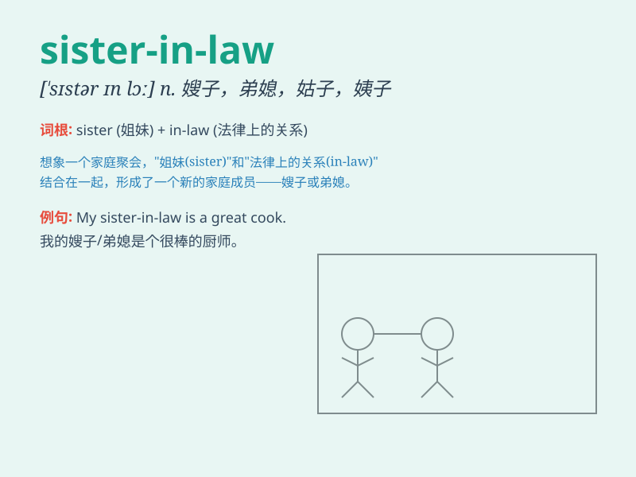

## sister-in-law

**英音:** _[ˈsɪstə(r) ɪn lɔː]_ **美音:** _[ˈsɪstər ɪn
lɔː]_

**译义:** *n.夫或妻的姊妹；嫂；弟媳*

### 短语

+ **elder sister-in-law:** _大嫂_

+ **younger sister-in-law:** _弟妹_

+ **sister-in-law\'s house:** _嫂子（或弟媳）家_

+ **visit sister-in-law:** _拜访嫂子（或弟媳）_

+ **get along with sister-in-law:** _与嫂子（或弟媳）相处_

### 例句

#### 例句1

> **My sister-in-law is a very kind person.**

**中文翻译:** 我的嫂子/弟媳是一个非常善良的人。

**单词释义:** 嫂子/弟媳

#### 例句2

> **I had a great time chatting with my sister-in-law at the
party.**

**中文翻译:** 在聚会上，我和我的嫂子/弟媳聊得很开心。

**单词释义:** 嫂子/弟媳

#### 例句3

> **My sister-in-law helps me a lot with housework.**

**中文翻译:** 我的嫂子/弟媳在做家务方面帮了我很多。

**单词释义:** 嫂子/弟媳

### 背诵小故事

> One day, my brother introduced me to a nice lady and said, \'This is
your sister-in-law.\' I was confused at first but then realized she was
married to my brother. Now I remember that sister-in-law means the wife
of one\'s brother.

**有一天，我哥哥给我介绍了一位漂亮女士并说：'这是你的嫂子。'一开始我很困惑，但随后意识到她是哥哥的妻子。现在我记住了
sister-in-law 就是兄或弟的妻子。**

### 图义

