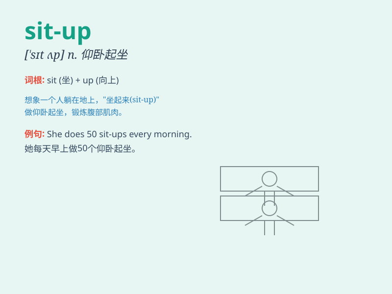

## sit-up

**英音:** _[ˈsɪt ʌp]_ **美音:** _[ˈsɪt ʌp]_

**译义:** *n.仰卧起坐*

### 短语

+ **do sit-ups:** _做仰卧起坐_

+ **sit-up exercise:** _仰卧起坐练习_

+ **daily sit-ups:** _每日仰卧起坐_

+ **intense sit-ups:** _高强度仰卧起坐_

+ **proper sit-ups:** _正确的仰卧起坐_

### 例句

#### 例句1

> **I do 50 sit-ups every morning to stay fit.**

**中文翻译:** 我每天早上做 50 个仰卧起坐来保持健康。

**单词释义:** 仰卧起坐

#### 例句2

> **The coach made us do three sets of sit-ups during the
training.**

**中文翻译:** 教练在训练期间让我们做三组仰卧起坐。

**单词释义:** 仰卧起坐

#### 例句3

> **She can do sit-ups easily because she has strong abdominal
muscles.**

**中文翻译:** 她能轻松做仰卧起坐，因为她有强壮的腹肌。

**单词释义:** 仰卧起坐

### 背诵小故事

> One day, Tom was too fat and decided to do sit-ups to get fit. He
struggled at first but kept doing them. Finally, he became strong and
healthy. Remember, sit-up is the exercise he did!

**有一天，汤姆太胖了，决定做仰卧起坐来健身。一开始他很吃力，但一直坚持。最后，他变得强壮又健康。记住，sit-up
就是他做的那种运动！**

### 图义

