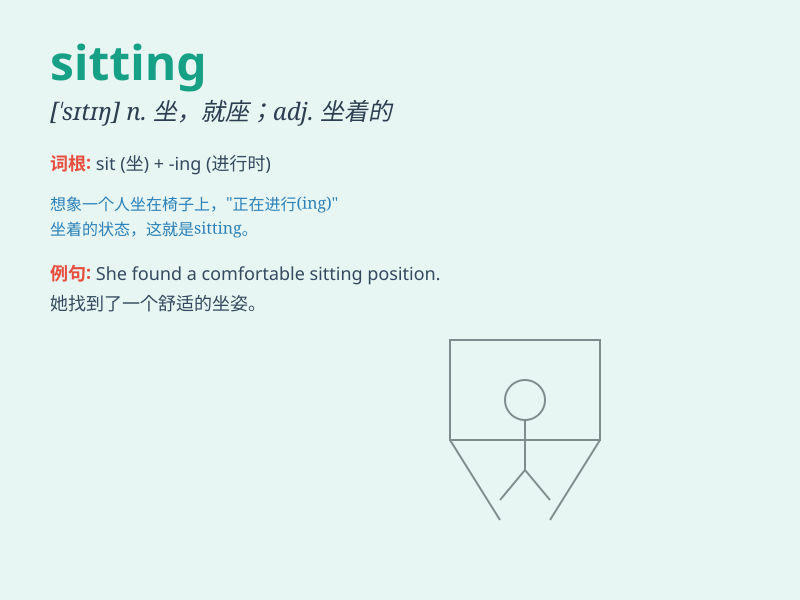

## sitting

**英音:** _[\'sɪtɪŋ]_ **美音:** _[\'sɪtɪŋ]_

**译义:**
*n.入席,就座,开会,孵卵adj.坐着的,就座的,在任期中的,孵卵中的,易击中的*

### 短语

+ **sitting room:** _客厅；起居室_

+ **sitting duck:** _易被击中的目标；易被欺骗的对象_

+ **sitting posture:** _坐姿_

+ **sitting president:** _现任总统_

+ **sitting tenant:** _（房屋的）现时租户_

### 例句

#### 例句1

> **She is sitting on the chair and reading a book.**

**中文翻译:** 她正坐在椅子上读书。

**单词释义:** 坐

#### 例句2

> **The cat is sitting in the sun.**

**中文翻译:** 这只猫正坐在阳光下。

**单词释义:** 坐

#### 例句3

> **I found him sitting alone in the park.**

**中文翻译:** 我发现他独自坐在公园里。

**单词释义:** 坐

### 背诵小故事

> One day, a little cat was sitting quietly on a soft cushion. It was
enjoying the peaceful moment and looking around with its big eyes.
Suddenly, a bird flew by, but the cat just kept sitting there, too lazy
to move.

**一天，一只小猫安静地坐在一个柔软的垫子上。它正享受着这宁静的时刻，睁着大眼睛四处张望。突然，一只鸟飞过，但小猫只是继续坐在那里，懒得动弹。**

### 图义

