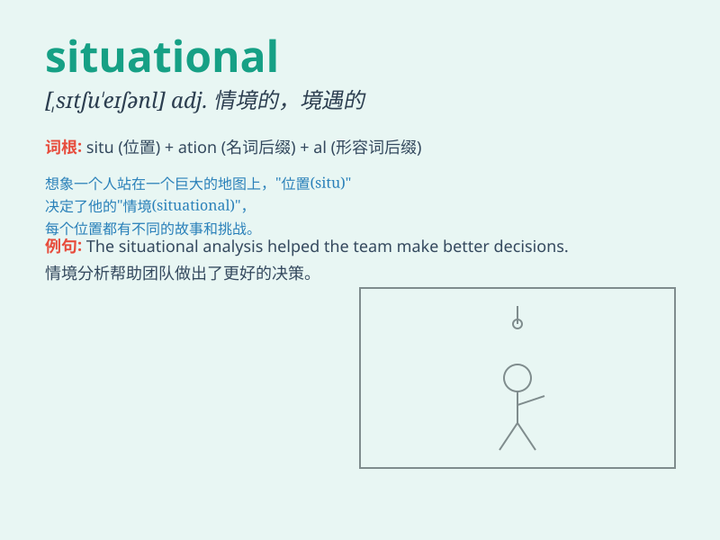

## situational

**英音:** _[ˌsɪtʃuˈeɪʃənl]_ **美音:** _[ˌsɪtʃuˈeɪʃənl]_

**译义:** *adj.情境的，情况上的，特定情境的*

### 短语

+ **situational awareness:** _情境意识；对周围环境的感知和理解_

+ **situational comedy:** _情景喜剧_

+ **situational factor:** _情境因素_

+ **situational leadership:** _情境领导；情境领导力_

+ **situational analysis:** _情境分析_

### 例句

#### 例句1

> **The training program focuses on situational awareness for
emergency responders.**

**中文翻译:** 这个培训项目侧重于应急响应人员的情境意识。

**单词释义:** 与情境有关的；情境的

#### 例句2

> **We need to make decisions based on the situational factors at
hand.**

**中文翻译:** 我们需要根据手头的情境因素做出决定。

**单词释义:** 情境的；与情况相关的

#### 例句3

> **His response was appropriate for the situational context.**

**中文翻译:** 他的回应对于当时的情境是恰当的。

**单词释义:** 情境的；状况的

### 背诵小故事

> A detective was solving a mystery. The clues were all situational,
depending on the specific place and time. He had to carefully observe
the situation to catch the criminal.

**一位侦探正在破解一个谜团。线索都是与情境相关的，取决于特定的地点和时间。他必须仔细观察情况才能抓住罪犯。**

### 图义

