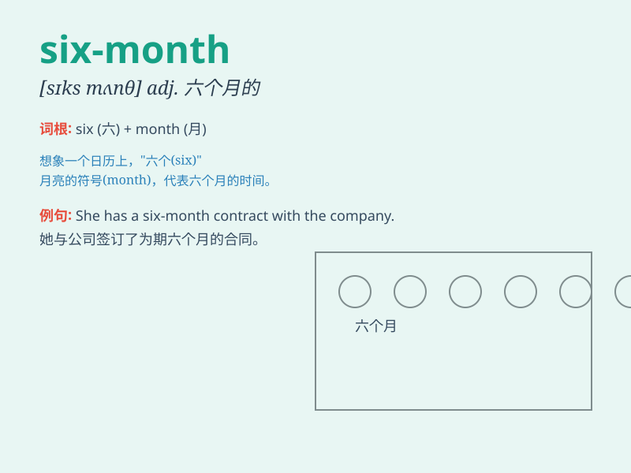

## six-month

**英音:** _[sɪks mʌnθ]_ **美音:** _[sɪks mʌnθ]_

**译义:** *n. 六个月的时间*

### 短语

+ **six-month period:** _六个月的时期_

+ **six-month contract:** _六个月的合同_

+ **six-month plan:** _六个月的计划_

+ **six-month review:** _六个月的审查_

+ **six-month anniversary:** _六个月纪念日_

### 例句

#### 例句1

> **The six-month project was finally completed successfully.**

**中文翻译:** 这个为期六个月的项目终于成功完成了。

**单词释义:** 为期六个月的

#### 例句2

> **She took a six-month break from work to travel.**

**中文翻译:** 她休了六个月的假去旅行。

**单词释义:** 六个月的

#### 例句3

> **The six-month training program improved his skills
significantly.**

**中文翻译:** 这个为期六个月的培训项目显著地提高了他的技能。

**单词释义:** 为期六个月的

### 背诵小故事

> Imagine a baby turtle that takes exactly six months to grow strong
enough to venture into the big ocean. This period of six months is very
important for its survival. So, \'six-month\' means a period of six
months.

**想象一只小海龟，它需要整整六个月的时间才能长得足够强壮去探索广阔的海洋。这六个月的时期对它的生存非常重要。所以，\'six-month\'意思是六个月的时期。**

### 图义

