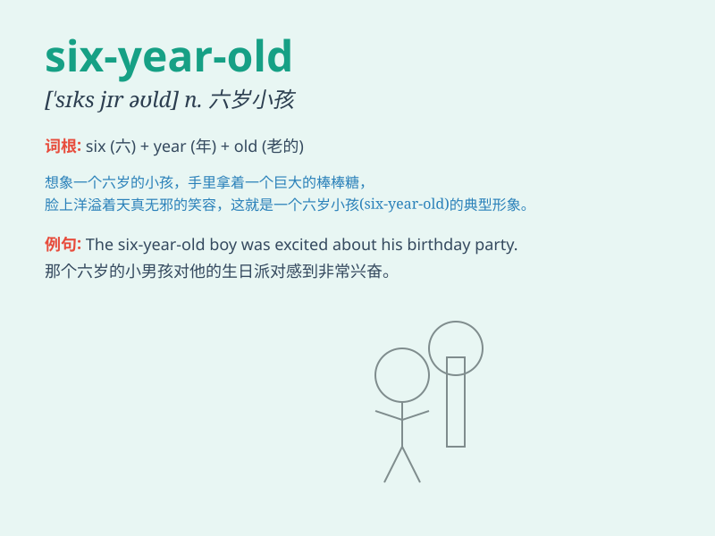

## six-year-old

**英音:** _[ˈsɪks jɪə r ˈəʊld]_ **美音:** _[ˈsɪks jɪr
ˈoʊld]_

**译义:** *六岁的，形容一个人或物品具有六年的年龄或历史*

### 短语

+ **six-year-old boy:** _六岁的男孩_

+ **six-year-old girl:** _六岁的女孩_

+ **a six-year-old child:** _一个六岁的孩子_

+ **six-year-old students:** _六岁的学生们_

+ **the six-year-old twins:** _这对六岁的双胞胎_

### 例句

#### 例句1

> **The six-year-old boy is very cute.**

**中文翻译:** 这个六岁的男孩非常可爱。

**单词释义:** 六岁的（用于形容男孩）

#### 例句2

> **My sister has a six-year-old daughter.**

**中文翻译:** 我姐姐有一个六岁的女儿。

**单词释义:** 六岁的（用于形容女儿）

#### 例句3

> **The six-year-old child can sing many songs.**

**中文翻译:** 这个六岁的孩子会唱很多歌。

**单词释义:** 六岁的（用于形容孩子）

### 背诵小故事

> One day, I met a six-year-old boy in the park. He was playing with a
kite and had a big smile. His innocence and joy made my day. Remember,
six-year-old describes someone who is six years old.

**有一天，我在公园遇到一个六岁的男孩。他正在玩风筝，脸上洋溢着大大的笑容。他的天真和快乐让我这一天都很美好。记住，six-year-old
描述的是六岁的人。**

### 图义

