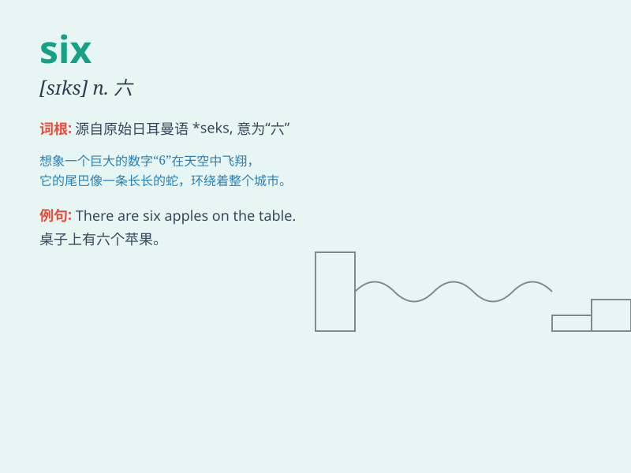

## six

**英音:** _[sɪks]_ **美音:** _[sɪks]_

**译义:** * num.六,六个*

### 短语

+ **six o\'clock:** _六点_

+ **six months:** _六个月_

+ **six people:** _六个人_

+ **six times:** _六次_

+ **group of six:** _六人小组_

### 例句

#### 例句1

> **There are six apples on the table.**

**中文翻译:** 桌子上有六个苹果。

**单词释义:** 六

#### 例句2

> **She is six years old.**

**中文翻译:** 她六岁了。

**单词释义:** 六

#### 例句3

> **I have to wake up at six in the morning.**

**中文翻译:** 我早上得在六点起床。

**单词释义:** 六点

### 背诵小故事

> There were six little ducks playing in the pond. They were having so
much fun. But then, a big dog came and scared five of them away. Only
one brave duck stayed. So, remember, six is like the number of those
original little ducks.

**有六只小鸭子在池塘里玩耍。它们玩得很开心。但是后来，一只大狗来了，吓跑了五只。只有一只勇敢的鸭子留了下来。所以，记住，six
就像最初小鸭子的数量。**

### 图义

