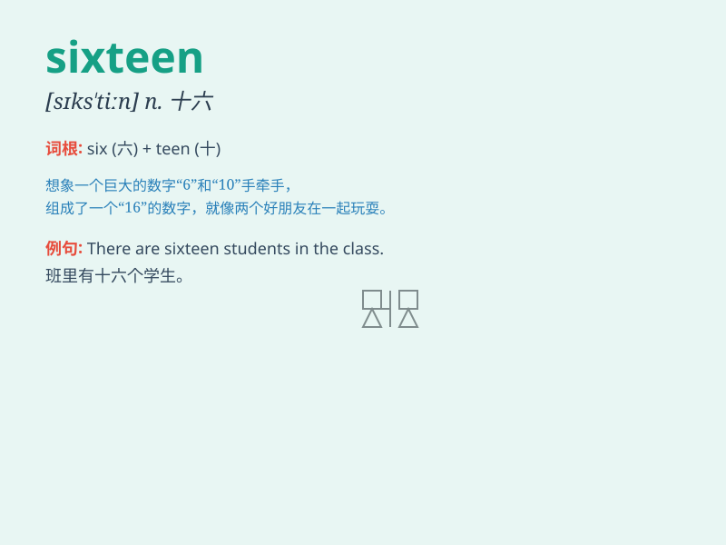

## sixteen

**英音:** _[sɪks\'tiːn; \'sɪkstiːn]_ **美音:**
_[,sɪks\'tin]_

**译义:** * num.十六*

### 短语

+ **sixteen years old:** _十六岁_

+ **at sixteen:** _在十六岁时_

+ **sixteen of them:** _他们中的十六个_

+ **sixteen more:** _再十六个_

+ **about sixteen:** _大约十六_

### 例句

#### 例句1

> **I\'m sixteen years old.**

**中文翻译:** 我十六岁了。

**单词释义:** 十六

#### 例句2

> **She got her driver\'s license when she was sixteen.**

**中文翻译:** 她十六岁时拿到了驾照。

**单词释义:** 十六

#### 例句3

> **There are sixteen students in our class.**

**中文翻译:** 我们班有十六个学生。

**单词释义:** 十六

### 背诵小故事

> One day, a little girl was celebrating her sixteenth birthday. She
had sixteen candles on her cake and received sixteen gifts. It was a
wonderful day full of joy and surprises.

**有一天，一个小女孩正在庆祝她的十六岁生日。她的蛋糕上有十六根蜡烛，还收到了十六份礼物。这是充满欢乐和惊喜的美妙一天。**

### 图义

