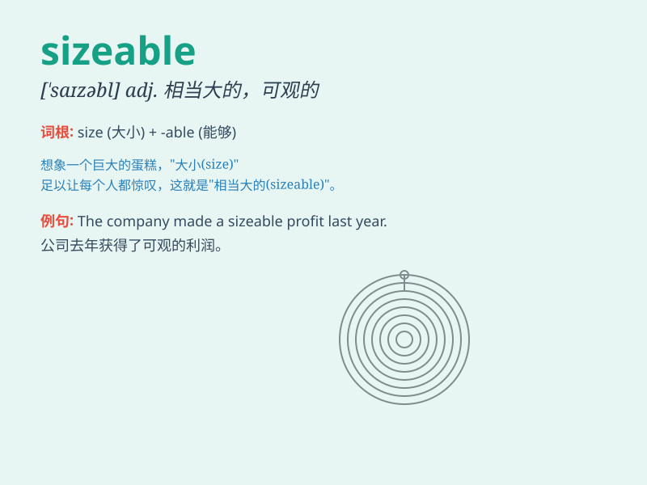

## sizeable

**英音:** _[ˈsaɪzəbl]_ **美音:** _[ˈsaɪzəbl]_

**译义:** *adj.相当大的,大的*

### 短语

+ **sizeable amount:** _相当大的数量_

+ **sizeable profit:** _可观的利润_

+ **sizeable investment:** _大规模投资_

+ **sizeable market:** _大规模市场_

+ **sizeable audience:** _大量观众_

### 例句

#### 例句1

> **The company made a sizeable profit this year.**

**中文翻译:** 这家公司今年获得了相当大的利润。

**单词释义:** 相当大的；可观的（指利润）

#### 例句2

> **We need a sizeable amount of money to start this project.**

**中文翻译:** 我们需要一笔可观的资金来启动这个项目。

**单词释义:** 可观的（指资金）

#### 例句3

> **The new shopping mall has a sizeable parking lot.**

**中文翻译:** 新的购物中心有一个相当大的停车场。

**单词释义:** 相当大的（指停车场）

### 背诵小故事

> A poor man was looking for treasure. One day, he found a sizeable
cave. In it, there were many jewels and gold. His life changed
completely. He became rich because of this sizeable discovery.

**一个穷人正在寻找宝藏。有一天，他发现了一个相当大的洞穴。在里面，有许多珠宝和黄金。因为这个相当大的发现，他的生活完全改变了。他变得富有了。**

### 图义

