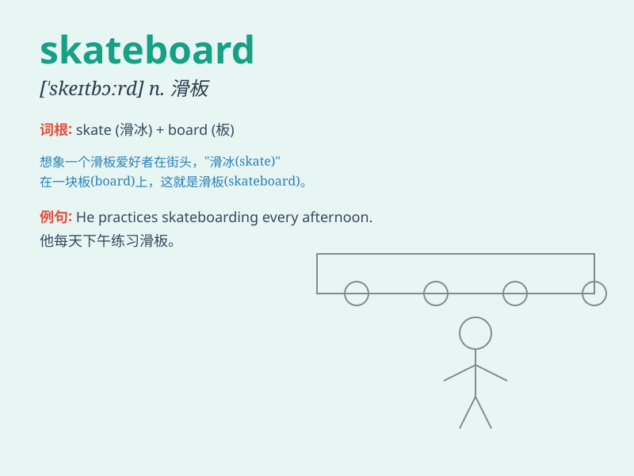

## skateboard

**英音:** _[\'skeɪtbɔːd]_ **美音:** _[\'sket\'bɔrd]_

**译义:** *n.溜冰板(一种装有滑轮的椭圆形滑板)*

### 短语

+ **ride a skateboard:** _骑滑板_

+ **skateboard park:** _滑板公园_

+ **skateboard tricks:** _滑板技巧_

+ **skateboard competition:** _滑板比赛_

+ **skateboard enthusiast:** _滑板爱好者_

### 例句

#### 例句1

> **He rides his skateboard to school every day.**

**中文翻译:** 他每天骑滑板去学校。

**单词释义:** 滑板

#### 例句2

> **She fell off the skateboard and hurt her knee.**

**中文翻译:** 她从滑板上摔下来，伤到了膝盖。

**单词释义:** 滑板

#### 例句3

> **The boy is very good at doing tricks on his skateboard.**

**中文翻译:** 这个男孩很擅长在他的滑板上做特技。

**单词释义:** 滑板

### 背诵小故事

> One day, a brave boy named Tom decided to ride his skateboard to
explore a new park. He showed amazing skills on the skateboard, jumping
over obstacles and having a great time. The skateboard became his best
friend for adventure.

**一天，一个勇敢的叫汤姆的男孩决定骑着他的滑板去探索一个新公园。他在滑板上展示了惊人的技巧，跳过障碍，玩得很开心。滑板成了他冒险的最好伙伴。**

### 图义

