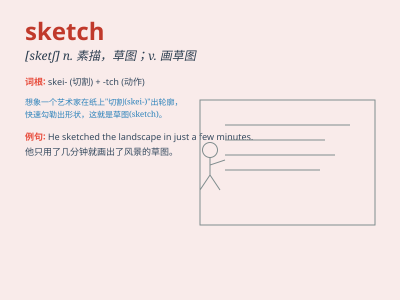

## sketch

**英音:** _[sketʃ]_ **美音:** _[skɛtʃ]_

**译义:** *n.略图,草图,概略,梗概,草图,拟定vi.绘略图,素描v.勾画*

### 短语

+ **sketch map:** _草图；示意图_

+ **sketch out:** _概述；草拟_

+ **quick sketch:** _快速素描；速写_

+ **character sketch:** _人物素描；人物速写_

+ **design sketch:** _设计草图_

### 例句

#### 例句1

> **She quickly made a sketch of the view from the window.**

**中文翻译:** 她很快画了一幅从窗口看到的景色的素描。

**单词释义:** 素描；草图

#### 例句2

> **The comedian did a hilarious sketch about daily life.**

**中文翻译:** 这位喜剧演员表演了一个关于日常生活的搞笑短剧。

**单词释义:** 短剧；小品

#### 例句3

> **He began to sketch out a plan for the new project.**

**中文翻译:** 他开始为新项目勾勒出一个计划。

**单词释义:** 概述；简述

### 背诵小故事

>
有一天，画家小明去野外旅行，他随身带着本子，看到美丽风景就快速(Sketch)画几笔。回家后，他看着这些草图，回忆起了旅行中的美好。

**有一天，画家小明去野外旅行，他随身带着本子，看到美丽风景就快速画几笔草图。回家后，他看着这些草图，回忆起了旅行中的美好。**

### 图义

