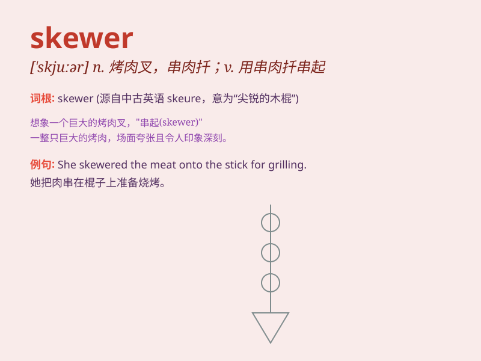

## skewer

**英音:** _[\'skjuːə]_ **美音:** _[\'skjʊɚ]_

**译义:** *n.(烤肉用的)串肉扦,扦,棒vt.上叉*

### 短语

+ **meat skewer:** _肉串_

+ **skewer through:** _刺穿_

+ **fruit skewer:** _水果串_

+ **skewer something together:** _用签子把某物串在一起_

+ **wooden skewer:** _木签_

### 例句

#### 例句1

> **She used a skewer to hold the meat together while grilling.**

**中文翻译:** 她在烧烤时用一根扦子把肉固定在一起。

**单词释义:** 扦子；串肉扦

#### 例句2

> **The chef skewered the vegetables and placed them on the
grill.**

**中文翻译:** 厨师把蔬菜串在扦子上，然后放在烤架上。

**单词释义:** 用扦子串起

#### 例句3

> **His sharp remarks skewered her argument.**

**中文翻译:** 他尖锐的言辞戳穿了她的论点。

**单词释义:** 刺穿；严厉批评

### 背诵小故事

> A hungry traveler was lost in the forest. Suddenly, he found a skewer
with delicious meat. It was like a magic stick that led him to a small
village where he got food and directions. Remember, a skewer can be a
savior in strange places!

**一位饥饿的旅行者在森林中迷路了。突然，他发现了一根串着美味肉的烤肉扦。它就像一根魔法棒，引领他来到了一个小村庄，在那里他得到了食物和指引。记住，烤肉扦在陌生的地方可能会成为救星！**

### 图义

