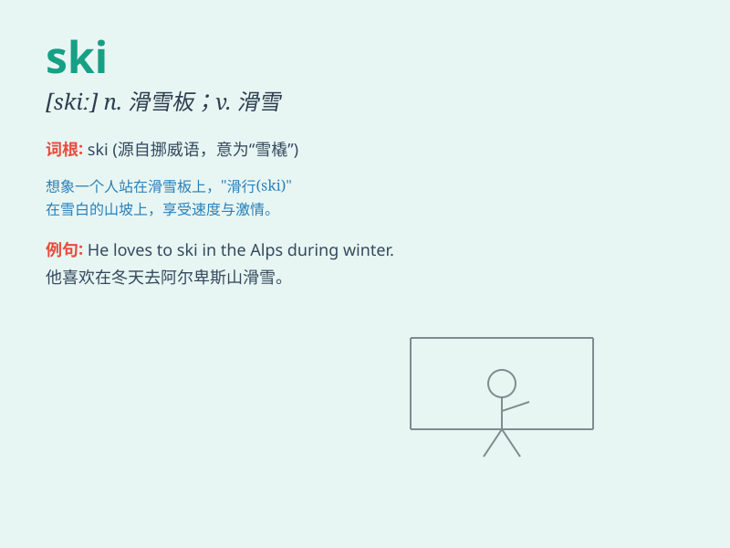

## ski

**英音:** _[skiː]_ **美音:** _[ski]_

**译义:** *n.滑雪橇vi.滑雪*

### 短语

+ **ski jump:** _跳台滑雪_

+ **ski resort:** _滑雪胜地_

+ **ski equipment:** _滑雪装备_

+ **ski race:** _滑雪比赛_

+ **ski slope:** _滑雪斜坡_

### 例句

#### 例句1

> **I love to ski in the mountains during winter.**

**中文翻译:** 我喜欢在冬天去山里滑雪。

**单词释义:** 滑雪（动词）

#### 例句2

> **She bought a new pair of skis for this skiing trip.**

**中文翻译:** 她为这次滑雪旅行买了一副新的滑雪板。

**单词释义:** 滑雪板（名词）

#### 例句3

> **The professional skier won the championship again.**

**中文翻译:** 这位职业滑雪运动员又赢得了冠军。

**单词释义:** 滑雪者（名词）

### 背诵小故事

> A brave boy wanted to show his courage. So, he decided to ski down a
very steep mountain. He wore his skis, held the poles, and sped down. It
was an exciting adventure!

**一个勇敢的男孩想要展示他的勇气。所以，他决定从一座非常陡峭的山上滑雪下来。他穿上滑雪板，拿着雪杖，快速滑下。这是一场令人兴奋的冒险！**

### 图义

