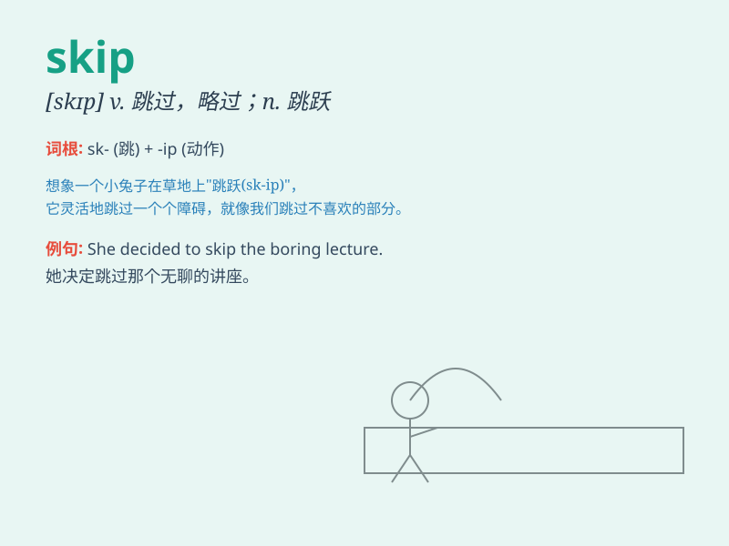

## skip

**英音:** _[skɪp]_ **美音:** _[skɪp]_

**译义:** *v.跳,蹦,急速改变,跳读,遗漏,跳跃n.跳跃*

### 短语

+ **skip class:** _逃课_

+ **skip rope:** _跳绳_

+ **skip over:** _略过；跳过_

+ **skip breakfast:** _不吃早餐_

+ **skip along:** _蹦蹦跳跳地走_

### 例句

#### 例句1

> **I decided to skip breakfast this morning.**

**中文翻译:** 我决定今天早上不吃早餐。

**单词释义:** 跳过；略过

#### 例句2

> **The little girl likes to skip rope in the yard.**

**中文翻译:** 这个小女孩喜欢在院子里跳绳。

**单词释义:** 跳绳

#### 例句3

> **Let\'s skip this chapter and move on to the next one.**

**中文翻译:** 咱们跳过这一章，接着看下一章。

**单词释义:** 跳过；略过

### 背诵小故事

> One day, Tom was in a hurry. He saw a long queue for the bus and
decided to skip it. He ran all the way to school and was very tired. But
he didn\'t miss the class. Remember, \'skip\' means to miss or pass over
something.

**一天，汤姆很着急。他看到等公交车的队伍很长，就决定不排队了。他一路跑到学校，很累。但他没有错过课。记住，\'skip\'意思是跳过或略过某物。**

### 图义

