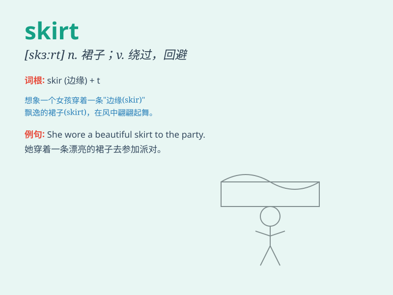

## skirt

**英音:** _[skɜːt]_ **美音:** _[skɝt]_

**译义:** *n.裙子v.环绕*

### 短语

+ **mini skirt:** _迷你裙_

+ **skirt around:** _回避；绕开_

+ **long skirt:** _长裙_

+ **pleated skirt:** _百褶裙_

+ **denim skirt:** _牛仔裙_

### 例句

#### 例句1

> **She wore a long skirt to the party.**

**中文翻译:** 她穿了一条长裙去参加聚会。

**单词释义:** 裙子

#### 例句2

> **The car skirted around the edge of the town.**

**中文翻译:** 汽车沿着城镇边缘迂回行驶。

**单词释义:** 沿着\...边缘走；避开

#### 例句3

> **The issue has been skirted by the politicians.**

**中文翻译:** 这个问题被政客们回避了。

**单词释义:** 回避；绕开

### 背诵小故事

> A girl was very happy because she got a beautiful skirt as a birthday
gift. The skirt was colorful and made her look like a fairy. She wore it
to many parties and always felt confident.

**一个女孩非常开心，因为她得到了一条漂亮的裙子作为生日礼物。这条裙子色彩斑斓，让她看起来像个仙女。她穿着它参加了很多聚会，总是感到自信。**

### 图义

