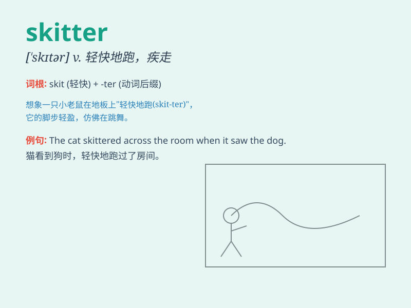

## skitter

**英音:** _[ˈskɪtə(r)]_ **美音:** _[ˈskɪtər]_

**译义:** *vi.掠过水面,沿水面拉动鱼钩钓鱼vt.使掠过水面*

### 短语

+ **skitter across:** _快速穿过_

+ **skitter away:** _迅速跑开_

+ **skitter along:** _沿着\...快速移动_

+ **skitter around:** _到处快速跑_

+ **skitter out of:** _从\...快速逃出_

### 例句

#### 例句1

> **The mouse skittered across the floor.**

**中文翻译:** 这只老鼠快速地穿过地板。

**单词释义:** 快速移动；急匆匆地跑

#### 例句2

> **The fish skittered away when it saw the shadow of the net.**

**中文翻译:** 鱼看到渔网的影子就急匆匆地游走了。

**单词释义:** （动物）快速逃窜

#### 例句3

> **Leaves skittered along the sidewalk in the wind.**

**中文翻译:** 树叶在风中沿着人行道快速移动。

**单词释义:** （物体）轻快地滑行

### 背诵小故事

> 一只小老鼠在黑暗的角落里快速移动，它的小脚 skitter
个不停，一会儿跑到这边，一会儿跑到那边，试图寻找食物。

**一只小老鼠在角落里快速移动，它的小脚不停地'疾跑'，试图寻找食物。**

### 图义

