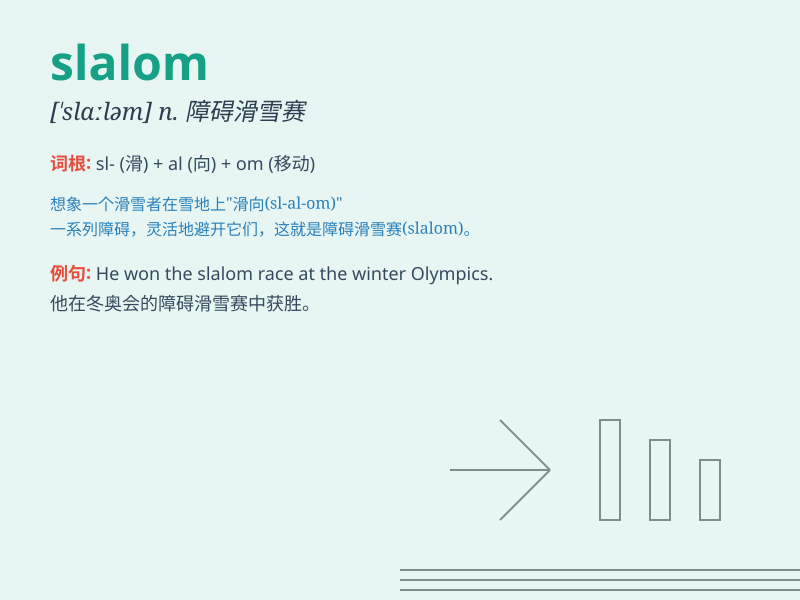

## slalom

**英音:** _[\'slɑːləm]_ **美音:** _[\'slɑləm]_

**译义:** *n.障碍滑雪*

### 短语

+ **ski slalom:** _滑雪回转赛_

+ **slalom course:** _回旋赛道_

+ **slalom race:** _回旋赛_

+ **slalom skiing:** _回转滑雪_

+ **water slalom:** _水上回转_

### 例句

#### 例句1

> **The skier expertly negotiated the slalom course.**

**中文翻译:** 这位滑雪者熟练地通过了障碍滑雪赛道。

**单词释义:**
障碍滑雪（一种在设有旗门的弯曲雪道上进行的滑雪比赛或运动）

#### 例句2

> **She was training hard for the slalom competition.**

**中文翻译:** 她正在为障碍滑雪比赛努力训练。

**单词释义:** 障碍滑雪比赛

#### 例句3

> **The car slalomed through the traffic cones on the test track.**

**中文翻译:** 汽车在测试赛道上穿梭于交通锥之间。

**单词释义:** 曲折地前行

### 背诵小故事

>
想象一下，一位勇敢的滑雪者在雪道上快速穿梭，左右迂回地避开障碍物，就像在玩一场刺激的'slalom'游戏。他的动作敏捷，不断改变方向，这就是'slalom'滑雪障碍赛的场景。

**想象一位滑雪者进行滑雪障碍赛来辅助记忆'slalom（滑雪障碍赛；曲折滑行）'这个单词**

### 图义

