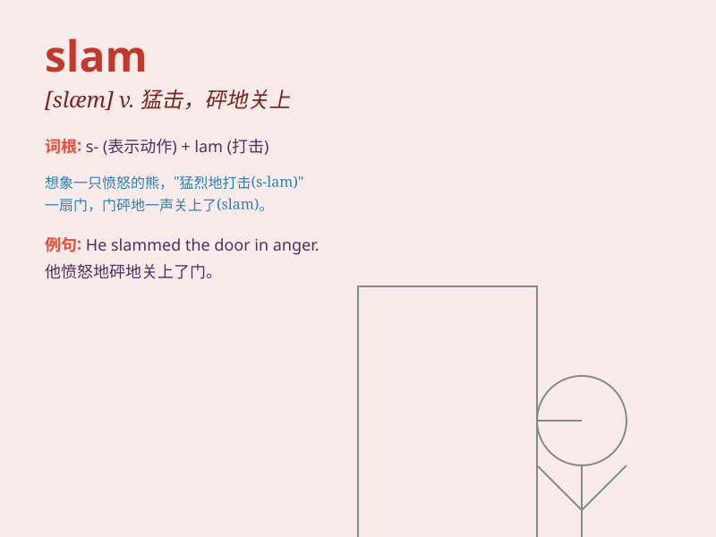

## slam

**英音:** _[slæm]_ **美音:** _[slæm]_

**译义:** *v.砰地关上,砰地放下,猛力抨击,冲击n.砰,猛击,撞击,冲击*

### 短语

+ **slam the door:** _猛地关门_

+ **slam into:** _猛撞；猛击_

+ **slam dunk:** _（篮球比赛中的）大力扣篮_

+ **slam on the brakes:** _猛踩刹车_

+ **slam poetry:** _即兴诗歌朗诵_

### 例句

#### 例句1

> **He slammed the door angrily.**

**中文翻译:** 他生气地砰地关上了门。

**单词释义:** 猛力关上

#### 例句2

> **The car slammed into the wall.**

**中文翻译:** 汽车猛地撞到了墙上。

**单词释义:** 猛撞

#### 例句3

> **She slammed the book down on the table.**

**中文翻译:** 她把书猛地摔在桌子上。

**单词释义:** 猛地放下

### 背诵小故事

> One day, a furious athlete slam the door hard after losing the game.
The sound of the slam was so loud that it echoed through the hallway.

**一天，一位愤怒的运动员在输掉比赛后用力摔门。摔门的声音非常大，在走廊里回荡。**

### 图义

