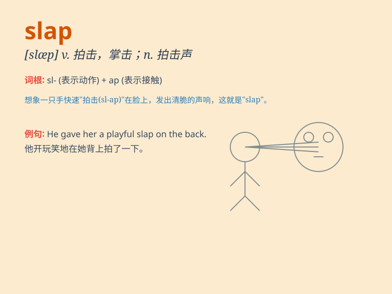

## slap

**英音:** _[slæp]_ **美音:** _[slæp]_

**译义:** *vt.拍,掌击,拍击n.拍,掌击,拍击*

### 短语

+ **slap on:** _随便地涂上；重重地拍打_

+ **slap down:** _镇压；压制_

+ **slap in the face:** _一记耳光；公然侮辱_

+ **slap someone\'s wrist:** _轻微地惩罚某人_

+ **a slap on the back:** _表扬；鼓励_

### 例句

#### 例句1

> **She slapped him across the face in anger.**

**中文翻译:** 她愤怒地扇了他一耳光。

**单词释义:** 扇，打

#### 例句2

> **The waves slapped against the rocks.**

**中文翻译:** 海浪拍打着岩石。

**单词释义:** 拍打

#### 例句3

> **He slapped a sticker on his notebook.**

**中文翻译:** 他在笔记本上啪地贴上一张贴纸。

**单词释义:** 猛贴，用力放

### 背诵小故事

> One day, Tom made a big mistake. His father was very angry and gave
him a slap on the face. Tom realized his fault and promised not to do it
again. The slap made a deep impression on him.

**一天，汤姆犯了个大错。他父亲非常生气，扇了他一耳光。汤姆意识到了自己的错误，并保证不再犯。这一耳光给他留下了深刻的印象。**

### 图义

