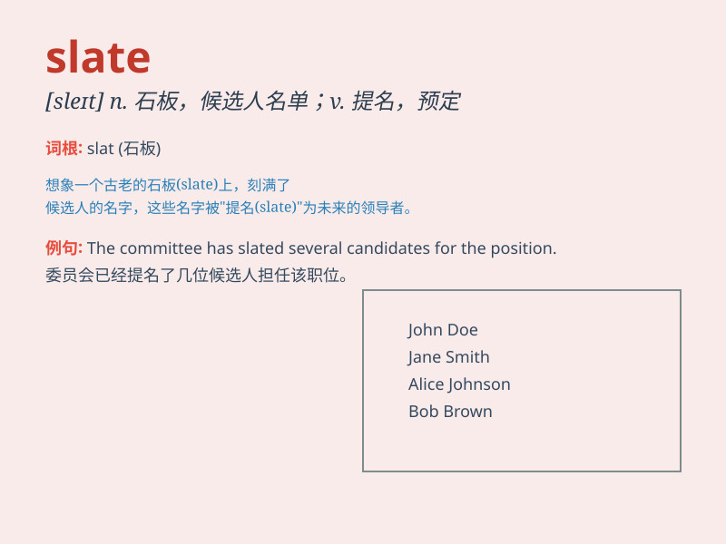

## slate

**英音:** _[sleɪt]_ **美音:** _[slet]_

**译义:** *n.板岩,石板,石片,蓝色adj.暗蓝灰色的,含板岩的v.铺石板*

### 短语

+ **clean slate:** _全新的开始；清白的历史_

+ **on the slate:** _记在账上_

+ **a slate roof:** _石板瓦屋顶_

+ **wipe the slate clean:** _把过去的事情一笔勾销_

+ **slate blue:** _石板蓝；深蓝色_

### 例句

#### 例句1

> **The roof was made of slate.**

**中文翻译:** 屋顶是用石板瓦做的。

**单词释义:** 石板瓦

#### 例句2

> **She was slated to become the new manager.**

**中文翻译:** 她已被选定为新经理。

**单词释义:** 选定

#### 例句3

> **His performance was slated by the critics.**

**中文翻译:** 他的表演受到了评论家的严厉批评。

**单词释义:** 严厉批评

### 背诵小故事

> A poor student had no money to buy a new notebook. So he used pieces
of slate to write on. One day, his teacher praised him for his creative
way of learning. Now you know \'slate\' means a kind of material for
writing.

**一个贫困的学生没钱买新笔记本。所以他用石板片来写字。有一天，他的老师称赞他这种有创意的学习方式。现在你知道\'slate\'指的是一种用于书写的材料。**

### 图义

