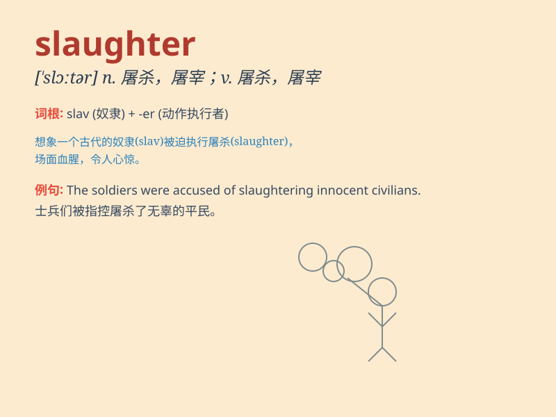

## slaughter

**英音:** _[\'slɔːtə]_ **美音:** _[\'slɔtɚ]_

**译义:** *n.屠宰,残杀,屠杀v.屠宰,残杀,屠杀*

### 短语

+ **slaughter house:** _屠宰场_

+ **mass slaughter:** _大规模屠杀_

+ **slaughter animals:** _屠宰动物_

+ **slaughter industry:** _屠宰业_

+ **slaughter method:** _屠宰方法_

### 例句

#### 例句1

> **The cattle were led to the slaughterhouse.**

**中文翻译:** 这些牛被牵往屠宰场。

**单词释义:** 屠宰

#### 例句2

> **The enemy troops suffered heavy slaughter in the battle.**

**中文翻译:** 敌军在战斗中遭受了惨重的杀戮。

**单词释义:** 杀戮；残杀

#### 例句3

> **He was accused of slaughtering innocent people.**

**中文翻译:** 他被指控屠杀无辜百姓。

**单词释义:** 屠杀

### 背诵小故事

> A farmer went to the slaughterhouse. He saw many animals waiting to
be slaughtered. The scene was sad. But he knew it was for providing
people with meat. \'Slaughter\' means to kill in a cruel way.

**一位农民去了屠宰场。他看到很多动物等着被宰杀。这场景很悲伤。但他知道这是为了给人们提供肉类。'slaughter'意思是以残忍的方式杀害。**

### 图义

