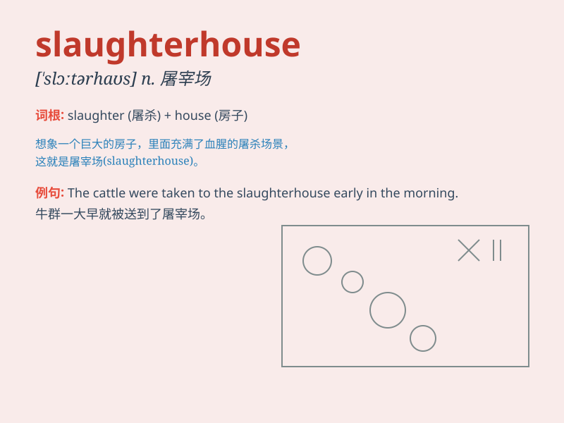

## slaughterhouse

**英音:** _[ˈslɔːtəhaʊs]_ **美音:** _[ˈslɔːtərhaʊs]_

**译义:** *n.屠宰场*

### 短语

+ **slaughterhouse worker:** _屠宰场工人_

+ **visit a slaughterhouse:** _参观屠宰场_

+ **slaughterhouse conditions:** _屠宰场的状况_

+ **close a slaughterhouse:** _关闭一家屠宰场_

+ **improve slaughterhouse practices:** _改进屠宰场的操作_

### 例句

#### 例句1

> **The animals were led to the slaughterhouse for processing.**

**中文翻译:** 动物们被带到屠宰场进行加工。

**单词释义:** 屠宰场

#### 例句2

> **The smell from the slaughterhouse was unbearable.**

**中文翻译:** 从屠宰场传来的气味让人无法忍受。

**单词释义:** 屠宰场

#### 例句3

> **He worked at the slaughterhouse for several years.**

**中文翻译:** 他在屠宰场工作了好几年。

**单词释义:** 屠宰场

### 背诵小故事

> A brave detective was investigating a crime. He followed a clue to a
slaughterhouse. There, he saw many animals being prepared for meat. It
was a scary scene. The word\'slaughterhouse\' means a place where
animals are killed for food.

**一位勇敢的侦探正在调查一起犯罪案件。他顺着一条线索来到了一个屠宰场。在那里，他看到许多动物正在被准备做成肉食。这是一个可怕的场景。单词"slaughterhouse"意思是屠宰场，即宰杀动物以供食用的地方。**

### 图义

