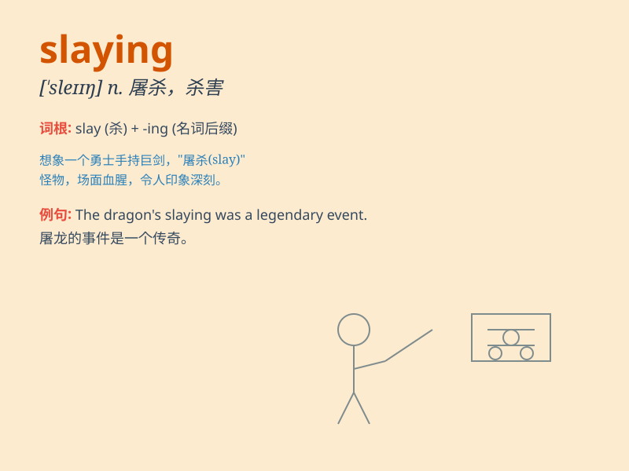

## slaying

**英音:** _[sleɪɪŋ]_ **美音:** _[sleɪɪŋ]_

**译义:** *n.杀人，屠宰；击倒，彻底击败（常用于比喻意义上）*

### 短语

+ **dragon slaying:** _屠龙_

+ **giant slaying:** _打败巨人_

+ **monster slaying:** _杀怪兽_

+ **evil slaying:** _除邪_

+ **beast slaying:** _杀野兽_

### 例句

#### 例句1

> **The hero was praised for slaying the dragon.**

**中文翻译:** 这位英雄因屠龙而受到赞扬。

**单词释义:** 杀死（尤指敌人或猛兽）

#### 例句2

> **The police are investigating the slaying of the businessman.**

**中文翻译:** 警方正在调查这位商人被杀一案。

**单词释义:** 谋杀，杀害

#### 例句3

> **She achieved fame by slaying her demons in the public eye.**

**中文翻译:** 她在公众面前战胜了自己的心魔而声名大噪。

**单词释义:** 战胜，克服（困难、恐惧等）

### 背诵小故事

> A brave knight was on a mission of slaying the fierce dragon that
terrorized the village. With his sharp sword and unwavering courage, he
finally achieved the slaying and saved everyone.

**一位勇敢的骑士肩负着斩杀那条恐吓村庄的凶猛巨龙的使命。凭借他锋利的剑和坚定不移的勇气，他最终完成了斩杀并拯救了所有人。**

### 图义

