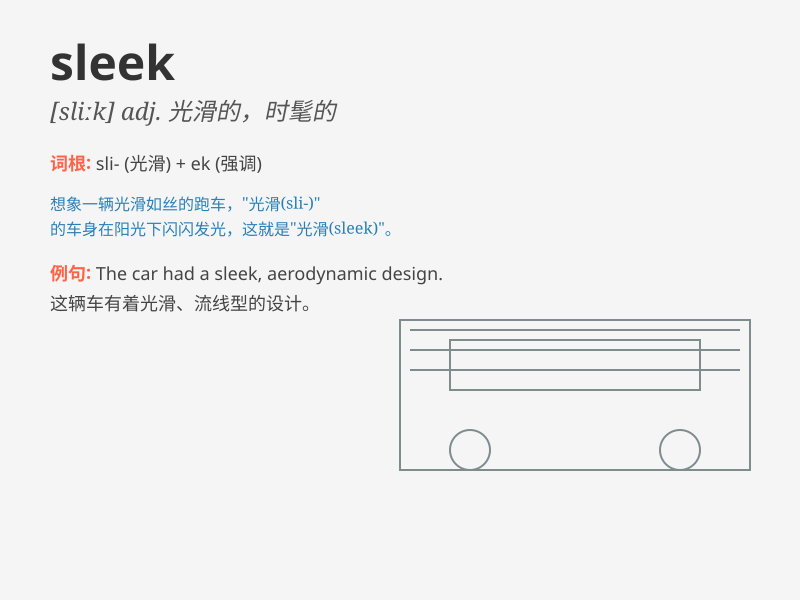

## sleek

**英音:** _[sliːk]_ **美音:** _[slik]_

**译义:** *adj.圆滑的*

### 短语

+ **sleek hair:** _柔顺的头发_

+ **sleek design:** _时尚的设计_

+ **sleek figure:** _苗条的身材_

+ **sleek car:** _造型优美的汽车_

+ **sleek surface:** _光滑的表面_

### 例句

#### 例句1

> **The sleek sports car zoomed past on the highway.**

**中文翻译:** 那辆光滑的跑车在高速公路上疾驰而过。

**单词释义:** 光滑的（形容跑车的外观）

#### 例句2

> **She has sleek black hair that shines in the sunlight.**

**中文翻译:** 她有一头在阳光下闪闪发亮的光滑黑发。

**单词释义:** 光滑的（形容头发）

#### 例句3

> **The sleek design of the new phone makes it very attractive.**

**中文翻译:** 新手机的时尚流畅设计使其非常有吸引力。

**单词释义:** 时尚流畅的（形容手机设计）

### 背诵小故事

> A sleek cat was running gracefully along the street. Its shiny fur
and smooth movements made it stand out. The word \'sleek\' describes
something that is smooth and shiny, just like the cat\'s appearance.

**一只光滑的猫优雅地沿着街道奔跑。它闪亮的皮毛和流畅的动作使它脱颖而出。单词"sleek"形容某物光滑且有光泽，就像这只猫的外表一样。**

### 图义

