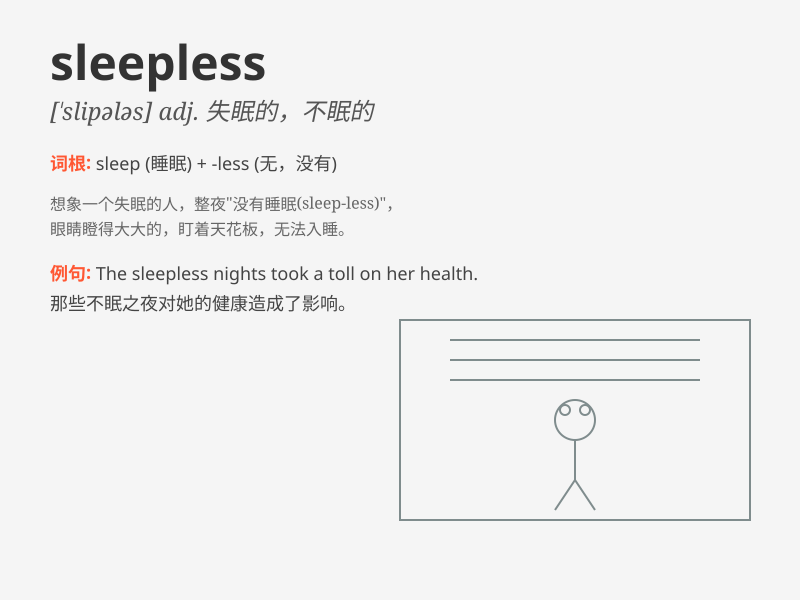

## sleepless

**英音:** _[\'sliːplɪs]_ **美音:** _[\'slipləs]_

**译义:** *adj.失眠的*

### 短语

+ **sleepless night:** _不眠之夜_

+ **sleepless in Seattle:** _《西雅图不眠夜》（电影名）_

+ **sleepless vigil:** _不眠的守夜_

+ **sleepless state:** _失眠状态_

+ **sleepless hours:** _无眠的时光_

### 例句

#### 例句1

> **She spent a sleepless night worrying about her exam.**

**中文翻译:** 她度过了一个不眠之夜，担心着她的考试。

**单词释义:** 无眠的；睡不着的

#### 例句2

> **The doctor has been having sleepless days due to the
pandemic.**

**中文翻译:** 由于这场大流行病，这位医生一直有很多无眠的日子。

**单词释义:** 失眠的；缺乏睡眠的

#### 例句3

> **After the argument, he lay sleepless in bed, thinking about what
happened.**

**中文翻译:** 争吵之后，他躺在床上睡不着，思考着所发生的事。

**单词释义:** 无法入睡的

### 背诵小故事

> One night, Tom had a lot of work to do. He stayed up all night and
became sleepless. Even when the sun rose, he couldn\'t sleep. Finally,
he understood the meaning of being sleepless - having no sleep.

**一天晚上，汤姆有很多工作要做。他整晚没睡，变得失眠了。甚至当太阳升起时，他也无法入睡。最后，他明白了
sleepless 的意思 - 无眠的。**

### 图义

