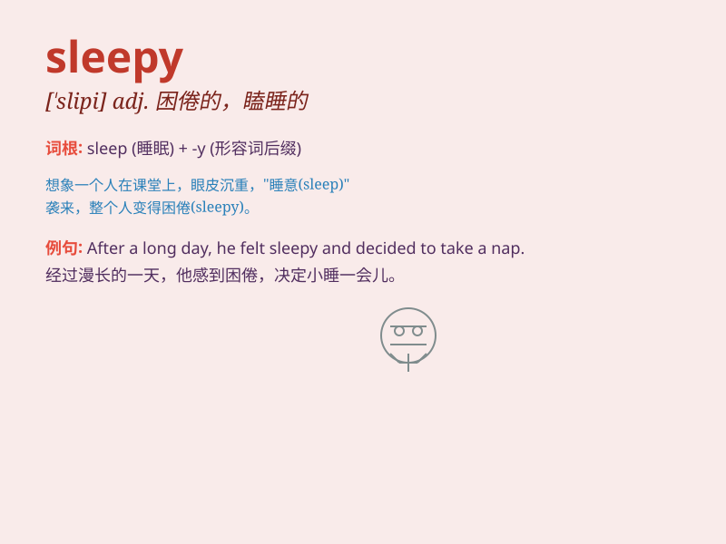

## sleepy

**英音:** _[\'sliːpɪ]_ **美音:** _[\'slipi]_

**译义:** *adj.困乏的,欲睡的*

### 短语

+ **sleepy head:** _瞌睡虫；贪睡者_

+ **feel sleepy:** _感到困倦_

+ **sleepy village:** _寂静的村庄_

+ **sleepy eyes:** _困倦的眼睛_

+ **a sleepy town:** _一个宁静的小镇_

### 例句

#### 例句1

> **I\'m feeling sleepy after a long day at work.**

**中文翻译:** 在工作了一整天之后，我感到困倦。

**单词释义:** 困倦的

#### 例句2

> **The sleepy town comes alive during the festival.**

**中文翻译:** 这个安静的小镇在节日期间变得热闹起来。

**单词释义:** 安静的；冷清的

#### 例句3

> **The cat looks sleepy as it lies in the sun.**

**中文翻译:** 这只猫躺在太阳下，看起来很困乏。

**单词释义:** 困乏的

### 背诵小故事

> One night, a little bear was very sleepy. It yawned and its eyes
could hardly stay open. It walked slowly to its bed and lay down. Soon,
it fell into a deep sleep. Poor sleepy bear!

**一天晚上，一只小熊非常困倦。它打着哈欠，眼睛几乎睁不开。它慢慢地走向它的床然后躺了下来。很快，它就陷入了沉睡。可怜的困倦小熊！**

### 图义

