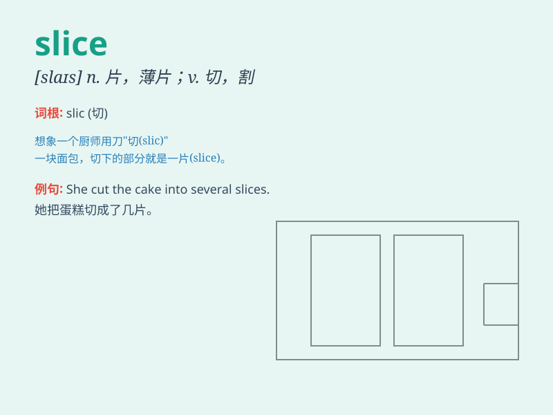

## slice

**英音:** _[slaɪs]_ **美音:** _[slaɪs]_

**译义:** *n.薄片,切片,一份,部分,片段v.切(片)*

### 短语

+ **a slice of:** _一片；一份_

+ **slice off:** _切掉；割掉_

+ **slice through:** _切开；割穿_

+ **thin slice:** _薄片_

+ **thick slice:** _厚片_

### 例句

#### 例句1

> **He cut a slice of bread for breakfast.**

**中文翻译:** 他切了一片面包当早餐。

**单词释义:** 片；薄片

#### 例句2

> **She took a slice of pizza from the box.**

**中文翻译:** 她从盒子里拿了一片披萨。

**单词释义:** 片；部分

#### 例句3

> **The surgeon made a careful slice during the operation.**

**中文翻译:** 外科医生在手术中小心地切开。

**单词释义:** 切开；割破

### 背诵小故事

> One day, I was very hungry. I went to the kitchen and took out a loaf
of bread. Then I used a knife to slice the bread into thin pieces. It
was so satisfying!

**一天，我非常饿。我走进厨房拿出一条面包。然后我用刀把面包切成薄片。这太让人满足了！**

### 图义

