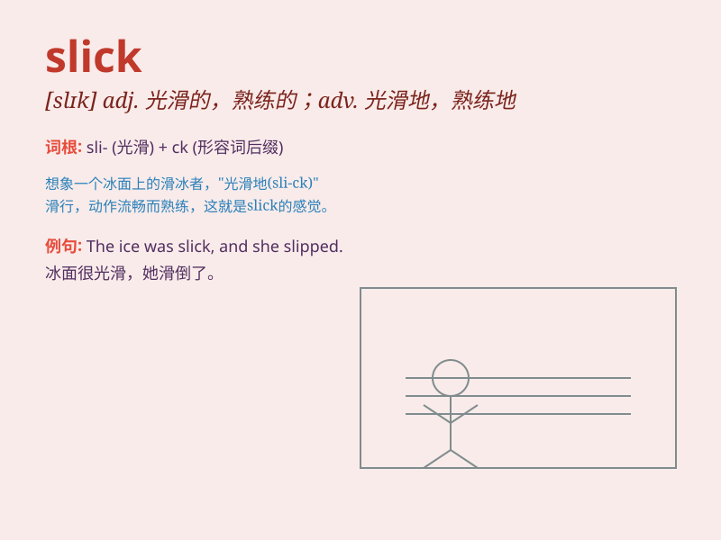

## slick

**英音:** _[slɪk]_ **美音:** _[slɪk]_

**译义:**
*adj.光滑的,熟练的,聪明的,华而不实的,陈腐的,平凡的,老套的adv.灵活地,聪明地vt.使光滑,使漂亮n.平滑的水面,平滑器,修光工具vi.打扮整洁*

### 短语

+ **slick surface:** _光滑的表面_

+ **slick move:** _巧妙的举动_

+ **slick hair:** _光滑的头发_

+ **slick talk:** _花言巧语_

+ **slick advertising:** _华而不实的广告_

### 例句

#### 例句1

> **The roads were slick after the rain.**

**中文翻译:** 雨后道路很滑。

**单词释义:** 滑的

#### 例句2

> **He gave a slick presentation that impressed everyone.**

**中文翻译:** 他做了一场精彩流畅的展示，给每个人都留下了深刻的印象。

**单词释义:** 流畅的；出色的

#### 例句3

> **She has a slick way of dealing with difficult customers.**

**中文翻译:** 她有一种巧妙的方式来应对难缠的客户。

**单词释义:** 巧妙的；圆滑的

### 背诵小故事

> One day, a car race was held. The track was very slippery. But there
was a driver whose car was slick and moved smoothly. He won the race
easily. Everyone was amazed by his slick car.

**有一天，举行了一场汽车比赛。赛道非常滑。但有一位车手，他的车很顺滑，行驶平稳。他轻松赢得了比赛。每个人都对他那辆顺滑的车感到惊讶。**

### 图义

