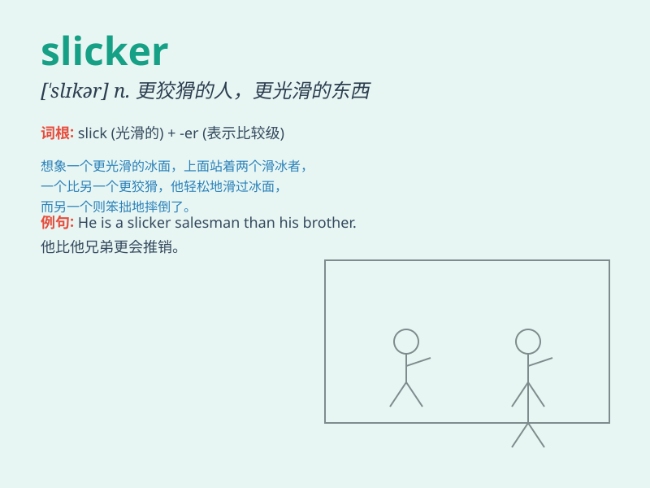

## slicker

**英音:** _[\'slɪkə]_ **美音:** _[\'slɪkɚ]_

**译义:** *n.雨衣,骗子,刮子*

### 短语

+ **city slicker:** _城市人（尤指不熟悉乡村生活的）_

+ **rain slicker:** _雨衣_

+ **slicker brush:** _光滑的刷子_

+ **oil slicker:** _浮油收集器_

+ **slicker operation:** _更圆滑的操作_

### 例句

#### 例句1

> **The rain made the roads slicker than usual.**

**中文翻译:** 雨水使得道路比平时更滑了。

**单词释义:** 更滑的

#### 例句2

> **He\'s a slicker salesman than his colleagues.**

**中文翻译:** 他是个比他同事更油滑的推销员。

**单词释义:** 油滑的；狡猾的

#### 例句3

> **The new car model has a slicker design.**

**中文翻译:** 这款新车型有更流畅的设计。

**单词释义:** 流畅的；光滑的

### 背诵小故事

> One rainy day, a man was walking in the street. His shoes were wet
until he put on a slicker. The slicker protected him from the rain and
made him feel dry and comfortable.

**在一个下雨天，一个男人正在街上走。他的鞋子湿了，直到他穿上一件雨衣。这件雨衣保护他免受雨淋，让他感到干爽舒适。**

### 图义

