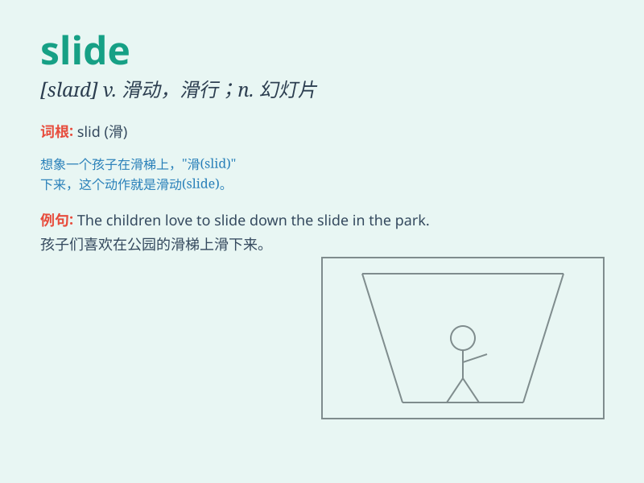

## slide

**英音:** _[slaɪd]_ **美音:** _[slaɪd]_

**译义:** *v.(使)滑动,(使)滑行n.滑,滑动,幻灯片*

### 短语

+ **slide show:** _幻灯片放映_

+ **slide into:** _不知不觉地陷入；逐渐陷入_

+ **water slide:** _水滑道_

+ **slide down:** _滑下；下滑_

+ **slide projector:** _幻灯机_

### 例句

#### 例句1

> **The child slid down the slide in the park.**

**中文翻译:** 孩子在公园里从滑梯上滑了下来。

**单词释义:** 滑；滑行

#### 例句2

> **The economy is starting to slide.**

**中文翻译:** 经济开始下滑。

**单词释义:** 下降；衰落

#### 例句3

> **She carefully slid the letter into the envelope.**

**中文翻译:** 她小心地把信塞进信封。

**单词释义:** （使）悄悄移动

### 背诵小故事

>
想象一下，在一个游乐场里，有一个长长的滑梯（slide）。小朋友们兴奋地爬上楼梯，然后顺着滑梯快速地滑下来，脸上洋溢着快乐的笑容。

**想象在游乐场中，小朋友们顺着长长的滑梯滑下，以此来记住 slide
这个单词，它有滑梯、滑动的意思。**

### 图义

